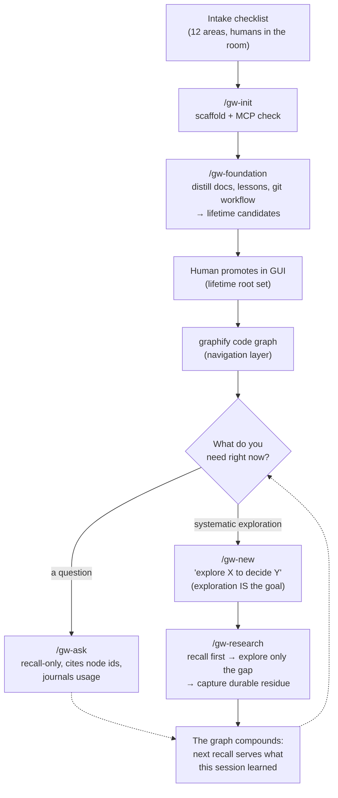

# Learning a new codebase with the graph-workflow

*(Polska wersja: [LEARNING-A-CODEBASE.pl.md](LEARNING-A-CODEBASE.pl.md))*

The graph-workflow has no "go read the whole codebase" phase — deliberately.
Front-loaded exploration produces understanding that lives in one person's (or
one session's) head and evaporates. Here, understanding is **accumulated through
changes and captured as graph knowledge**: every question answered and every
subsystem explored leaves nodes behind, and every future session recalls them
instead of re-deriving them. Re-deriving settled knowledge is the failure mode
the whole design exists to prevent.

## Phase 0 — Intake (before any tooling)

Walk `docs/INTAKE.md` with the humans who will play the workflow's roles:
facet vocabulary, capture policy, change granularity, review capacity,
promotion authority. The normative answers are themselves a foundation
document — they get distilled in the next step, not left as prose nobody
recalls.

## Phase 1 — `/gw-init` + `/gw-foundation` (once, at adoption)

`/gw-init` scaffolds `context/{changes,archive,foundation}/` and verifies the
agentic-memory MCP surface answers. Then `/gw-foundation` does the heavy lift
for a brownfield project — distilling everything that already encodes
understanding into graph artifacts:

| Source | Becomes |
|---|---|
| PRD non-negotiables | `constraint` nodes |
| Domain terms | `concept` nodes |
| ADRs / tech-stack choices | `decision` nodes (with the why) |
| Known accepted gaps | `issue` nodes |
| **`lessons.md` + normative CLAUDE.md/AGENTS.md rules** | `constraint` nodes — the highest-value targets: they encode mistakes the project already paid for |
| **The git workflow** (branching, PR flow, merge strategy, commit conventions) | one of the **first lessons** — every change, worktree, and headless run acts on it |
| Intake answers | `constraint`/`decision` nodes (facet policy, capture line, mode routing) |

One statement per node, readable cold — a 40-node distillation that recall can
rank beats one blob that always ranks or never does. Everything captured here is
a **lifetime-promotion candidate**: the human confirms in the GUI, which puts
foundation knowledge into the always-live root set every future recall draws
from. Without this step, the first ten changes run on empty recall bundles and
agents re-derive (or contradict) the project's own documents.

## Phase 2 — the navigation layer

When the project has a graphify code knowledge graph (`graphify-out/`
present), **code navigation goes through the graphify MCP first** —
architecture, file relationships, community structure come from graph queries;
raw grep/read is the fallback for what the code graph doesn't cover, not the
default. "Learning the layout" is a query, not a directory crawl.

Note the division of labor: the **graphify graph** knows what the code *is*
(structure, derivable from source at any time); the **memory graph** knows what
the team *decided, constrained, and learned* (not derivable from source). Both
are consulted; only the second is written to.

## Phase 3 — learn on demand, two paths

### A question, no work attached → `/gw-ask`

Recall-only, through the foundation scope's `memory_goal`. The answer is built
from the bundle first, code second, citing `[node:<id>]` for every claim so
provenance is checkable. Disputed nodes are presented with BOTH sides. The
session journals honest `USED`/`NOTED` events — day-to-day Q&A is how ranking
learns what people actually need. `/gw-ask` has **no capture authority**: if the
conversation surfaces knowledge the graph lacks, that's work — route it to a
change.

### Systematic exploration → an exploratory change

`/gw-new` supports this explicitly: *for exploratory work, the exploration IS
the goal* ("explore the payments subsystem to decide if webhooks can be made
idempotent"). Then `/gw-research` runs the actual learning discipline:

1. **Recall before exploring.** Load what the graph already knows about the
   territory. Order is signal; keep the `[node:<id>]` handles.
2. **Scope the gap.** What recall did NOT answer — that list, not the change
   title, is the research agenda. If recall answered everything, say so and
   stop; research theater helps nobody.
3. **Explore only the gap.** Graphify-first navigation; fan out read-only
   subagents for independent questions; keep conclusions, not file dumps; cite
   `file:line`; distinguish observed fact from inference.
4. **Reconcile memory against reality.** Reality agrees → `CONFIRMED`. Reality
   disagrees → capture the correction with a `CONTRADICTS` edge (the flag it
   raises is the system working). Reality reveals a dependency the graph lacks
   → add the edge so the next `impact_of` trace is complete.
5. **Capture the durable residue.** `concept` for settled models, `constraint`
   for what future work must respect, `invariant` for what must always hold,
   `issue` for problems left standing. Never narration, never file paths that
   churn, never what the repo states verbatim.
6. **Journal** one batched `append_events` — honest events only.
7. **Write the thin `research.md`** — questions, answers with cites, and the
   captured node list. The knowledge is in the graph; the file is the pointer
   trail.

## Phase 4 — compounding (the actual mechanism)

Understanding of the codebase *is* the graph after a few cycles:

- Every change's seed recall serves what earlier changes learned — including
  across an epic, where sibling slices hand their surviving nodes forward as
  `parent_refs` and share an epic facet.
- The review gate consolidates each episode (episodic → semantic): a
  change-summary node distills what the change did and why, promoted before the
  sweep sends the working detail dormant.
- A session that recalls but never journals starves future ranking — feedback
  is mandatory, one batch per phase/session.

Observed in practice (coffer dogfood): by slice 2, the implementing agent got
the persistence schema's key design fact — transactions have no surrogate id,
so assignments key on `content_hash` — from a recalled node, not from
re-reading slice 1's code. That is the workflow's definition of "having
learned the codebase."

## Anti-patterns this replaces

| Instead of… | The workflow does… |
|---|---|
| A week of "onboarding reading" that leaves no artifact | Foundation distillation + exploratory changes that leave ranked, recallable nodes |
| Asking the senior dev the same question quarterly | `/gw-ask` serving the settled answer with provenance, and ranking learning it matters |
| Onboarding docs that rot | Docs stay the human source of truth; their normative content lives in the graph, where staleness gets *flagged* (CONTRADICTS → review queue) instead of silently accumulating |
| "The codebase is the documentation" | The codebase is what the code *is*; the graph holds what was *decided and learned* — the part `git blame` can't tell you |
