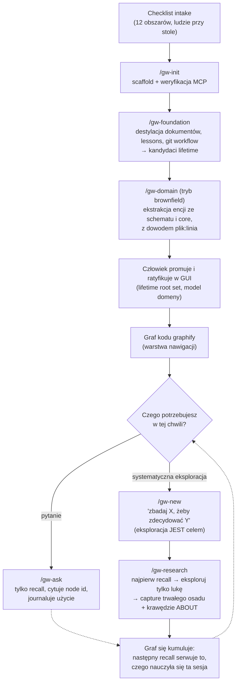

# Poznawanie nowego codebase'u z graph-workflow

*(English version: [LEARNING-A-CODEBASE.md](LEARNING-A-CODEBASE.md))*

Graph-workflow celowo nie ma fazy „przeczytaj cały codebase". Eksploracja
zrobiona na zapas produkuje zrozumienie, które żyje w głowie jednej osoby (albo
jednej sesji) i wyparowuje. Tutaj zrozumienie **akumuluje się przez zmiany i
jest capture'owane jako wiedza w grafie**: każde odpowiedziane pytanie i każdy
zbadany podsystem zostawia po sobie węzły, a każda przyszła sesja je recall'uje
zamiast wyprowadzać od nowa. Ponowne wyprowadzanie ustalonej wiedzy to tryb
awarii, przed którym cały projekt ma chronić.

## Faza 0 — Intake (zanim dotkniesz narzędzi)

Przejdź `docs/INTAKE.pl.md` z ludźmi, którzy będą pełnić role workflow:
słownik facetów, polityka capture, granularność zmian, przepustowość review,
autorytet promocji. Normatywne odpowiedzi same są dokumentem fundamentowym —
zostaną zdestylowane w następnym kroku, a nie zostawione jako proza, której
nikt nie recall'uje.

## Faza 1 — `/gw-init` + `/gw-foundation` (raz, przy adopcji)

`/gw-init` scaffolduje `context/{changes,archive,foundation}/` i weryfikuje, że
powierzchnia MCP agentic-memory odpowiada. Potem `/gw-foundation` wykonuje
najcięższą pracę na projekcie brownfield — destyluje wszystko, co już koduje
zrozumienie, w artefakty grafu:

| Źródło | Staje się |
|---|---|
| Niepodważalne zapisy PRD | węzły `constraint` |
| Terminy domenowe | węzły `concept` |
| ADR-y / wybory tech-stacku | węzły `decision` (z uzasadnieniem) |
| Znane zaakceptowane luki | węzły `issue` |
| **`lessons.md` + normatywne reguły CLAUDE.md/AGENTS.md** | węzły `constraint` — cele o najwyższej wartości: kodują błędy, za które projekt już zapłacił |
| **Git workflow** (branching, PR flow, strategia merge, konwencje commitów) | jedna z **pierwszych lekcji** — każda zmiana, worktree i przebieg headless na nim działa |
| Odpowiedzi z intake | węzły `constraint`/`decision` (polityka facetów, linia capture, routing trybów) |
| Terminy domenowe w którymkolwiek z powyższych | **węzły `entity`** przez `/gw-domain` — nazwa to nie twierdzenie i należy do modelu domeny, nie do węzła `concept` |

Jedno zdanie na węzeł, czytelne na zimno — destylacja na 40 węzłów, które
recall umie rankować, bije jednego blob-a, który zawsze rankuje albo nigdy.
Wszystko scapture'owane tutaj to **kandydat do promocji lifetime**: człowiek
potwierdza w GUI, co wkłada wiedzę fundamentową do zawsze-żywego root setu, z
którego czerpie każdy przyszły recall. Bez tego kroku pierwsze dziesięć zmian
działa na pustych bundlach recall i agenci wyprowadzają od nowa (albo
zaprzeczają) własnym dokumentom projektu.

### Następnie `/gw-domain` — rzeczowniki projektu

`/gw-foundation` zbiera **twierdzenia** projektu. `/gw-domain` w **trybie
brownfield** zbiera jego **rzeczowniki**, a na nieznanej bazie kodu to najbardziej
wydajny przebieg uczenia się, jaki jest dostępny: ekstrakcja domeny zmusza cię do
przeczytania schematu i modułów core z jednym konkretnym pytaniem i produkuje
ustalenia, których nie da nic innego.

| Źródło | Co daje |
|---|---|
| Schemat persystencji, migracje, modele ORM | Encje z prawdziwą tożsamością — rzeczy z własną tabelą zwykle mają własne życie |
| Moduły core/domain (warstwa bez importów frameworka) | Własny model zespołu, w ich własnych typach |
| PRD / słowniczek | Często *aspiracyjne*; tam gdzie nie zgadza się z kodem, zaproponuj nazwę z kodu i **oznacz rozjazd** |
| Powierzchnia API, teksty UI | Słownictwo skierowane do klienta — często prawdziwy język wszechobecny, podczas gdy kod niesie starszy |

Bezsporne encje to łatwa połowa. **Ustalenia o rozjeździe** są powodem, dla którego
warto uruchomić ten przebieg na bazie kodu, której nie znasz:

- **synonimy** — `client` w schemacie, `customer` w PRD;
- **homonimy** — `account` jako konto księgowe *i* jako login (zaproponuj oba, każdy
  definiujący się wobec drugiego);
- **terminy tylko-w-kodzie** — modelowane, ale nikt o nich nie mówi: albo brakujące
  pojęcie domenowe, albo przeciekający szczegół implementacyjny; zapytaj który;
- **terminy tylko-w-mowie** — nazywane przez użytkowników, nieobecne w kodzie. Często
  najcenniejsze ustalenie całego przebiegu.

Każda propozycja niesie `plik:linia`, więc recenzent sprawdza ją w sekundy, zamiast
rozstrzygać z pamięci. Proponuj paczkami po 8–12 w formie tabeli i pozwól
użytkownikowi wykreślić, przemianować i rozdzielić wiersze **zanim** cokolwiek
zcapture'ujesz. Uporczywa pułapka: struktura bazy kodu to nie domena —
`UserRepository` nie jest encją, `User` być może jest.

Każda encja ląduje jako `proposed`; człowiek ratyfikuje w zakładce Domain w GUI.
Zysk kumuluje się ze wszystkim, co potem: `ABOUT` to jedyny typ krawędzi, którego
kierunek odwrotny przechodzi wyszukiwanie, więc gdy artefakty zostaną podpięte do
`Invoice`, sesja pół roku później pytająca o faktury dostanie je — łącznie z tymi
zcapture'owanymi pod innym celem, w zmianie dawno zarchiwizowanej.

## Faza 2 — warstwa nawigacji

Gdy projekt ma graf wiedzy o kodzie graphify (obecny `graphify-out/`),
**nawigacja po kodzie idzie najpierw przez MCP graphify** — architektura,
relacje plików, struktura społeczności pochodzą z zapytań do grafu; surowy
grep/read to fallback dla tego, czego graf kodu nie pokrywa, a nie domyślna
ścieżka. „Nauka układu" to zapytanie, nie crawl po katalogach.

Zwróć uwagę na podział pracy: **graf graphify** wie, czym kod *jest*
(struktura, wyprowadzalna ze źródeł w każdej chwili); **graf pamięci** wie, co
zespół *zdecydował, ograniczył i czego się nauczył* (niewyprowadzalne ze
źródeł). Odpytywane są oba; zapisywany jest tylko drugi.

## Faza 3 — nauka na żądanie, dwie ścieżki

### Pytanie bez podpiętej pracy → `/gw-ask`

Tylko recall, przez `memory_goal` zakresu foundation. Odpowiedź budowana
najpierw z bundle'a, potem z kodu, z cytatem `[node:<id>]` przy każdym
twierdzeniu, żeby pochodzenie było sprawdzalne. Węzły disputed prezentowane z
OBIEMA stronami. Sesja journaluje uczciwe eventy `USED`/`NOTED` — codzienne
Q&A to sposób, w jaki ranking uczy się, czego ludzie naprawdę potrzebują.
`/gw-ask` **nie ma prawa capture**: jeśli rozmowa odsłania wiedzę, której graf
nie ma, to jest praca — kieruj ją do zmiany.

### Systematyczna eksploracja → zmiana eksploracyjna

`/gw-new` wspiera to wprost: *dla pracy eksploracyjnej eksploracja JEST celem*
(„zbadaj podsystem płatności, żeby zdecydować, czy webhooki da się zrobić
idempotentne"). Potem `/gw-research` wykonuje właściwą dyscyplinę nauki:

1. **Recall przed eksploracją.** Załaduj, co graf już wie o terytorium.
   Kolejność jest sygnałem; zachowaj handle `[node:<id>]`.
2. **Wyznacz lukę.** To, na co recall NIE odpowiedział — ta lista, nie tytuł
   zmiany, jest agendą researchu. Jeśli recall odpowiedział na wszystko, powiedz
   to i przestań; teatr researchu nikomu nie pomaga.
3. **Eksploruj tylko lukę.** Nawigacja najpierw graphify; rozproszeni
   read-only subagenci do niezależnych pytań; zachowuj wnioski, nie zrzuty
   plików; cytuj `file:line`; odróżniaj fakt zaobserwowany od wniosku.
4. **Uzgodnij pamięć z rzeczywistością.** Rzeczywistość się zgadza →
   `CONFIRMED`. Rzeczywistość się nie zgadza → capture korekty z krawędzią
   `CONTRADICTS` (flaga, którą to podnosi, to system działający poprawnie).
   Rzeczywistość odsłania zależność, której graf nie ma → dodaj krawędź, żeby
   następny trace `impact_of` był kompletny.
5. **Capture trwałego osadu.** `concept` dla ustalonych modeli, `constraint`
   dla tego, co przyszła praca musi respektować, `invariant` dla tego, co musi
   zawsze zachodzić, `issue` dla problemów zostawionych otwartych. Nigdy
   narracja, nigdy ścieżki plików, które się zmieniają, nigdy to, co repo mówi
   dosłownie.
6. **Journaluj** jeden zbiorczy `append_events` — tylko uczciwe eventy.
7. **Napisz cienki `research.md`** — pytania, odpowiedzi z cytatami i lista
   scapture'owanych węzłów. Wiedza jest w grafie; plik to trop wskaźników.

## Faza 4 — kumulacja (właściwy mechanizm)

Zrozumienie codebase'u po kilku cyklach *jest* grafem:

- Seed recall każdej zmiany serwuje to, czego nauczyły się wcześniejsze — w tym
  w poprzek epika, gdzie sąsiednie slice'y przekazują dalej swoje przetrwałe
  węzły jako `parent_refs` i dzielą facet epika.
- Bramka review konsoliduje każdy epizod (epizodyczne → semantyczne): węzeł
  change-summary destyluje, co zmiana zrobiła i dlaczego, promowany zanim sweep
  uśpi roboczy detal.
- Sesja, która recall'uje, ale nigdy nie journaluje, głodzi przyszły ranking —
  feedback jest obowiązkowy, jeden batch na fazę/sesję.

Zaobserwowane w praktyce (dogfood coffer): przy slice 2 agent implementujący
dostał kluczowy fakt projektowy schematu persystencji — transakcje nie mają
sztucznego id, więc przypisania kluczują po `content_hash` — z recall'owanego
węzła, nie z ponownego czytania kodu slice'a 1. To jest definicja „nauczenia
się codebase'u" według tego workflow.

## Antywzorce, które to zastępuje

| Zamiast… | Workflow robi… |
|---|---|
| Tydzień „czytania onboardingowego", po którym nie zostaje artefakt | Destylacja foundation + ekstrakcja domeny + zmiany eksploracyjne zostawiające rankowane, recall'owalne węzły |
| Pytanie seniora o to samo co kwartał | `/gw-ask` serwujący ustaloną odpowiedź z pochodzeniem, a ranking uczy się, że to ważne |
| „Jak to nazywamy?" — z inną odpowiedzią od każdego członka zespołu | Ratyfikowany model domeny: `domain_model()` odpowiada, a rozjazd wychodzi jako jawne ustalenie zamiast po cichu rozszczepiać słownictwo |
| Dokumenty onboardingowe, które gniją | Dokumenty pozostają ludzkim źródłem prawdy; ich normatywna treść żyje w grafie, gdzie nieświeżość jest *flagowana* (CONTRADICTS → kolejka review) zamiast cicho narastać |
| „Codebase jest dokumentacją" | Codebase to to, czym kod *jest*; graf trzyma to, co *zdecydowano i czego się nauczono* — część, której `git blame` nie powie |
