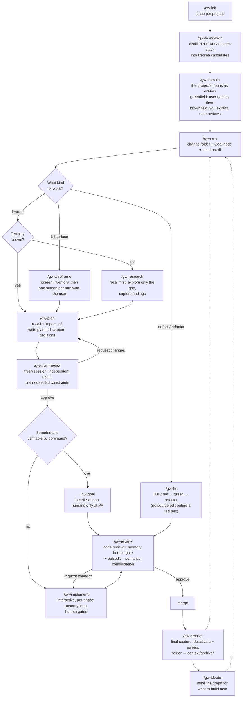
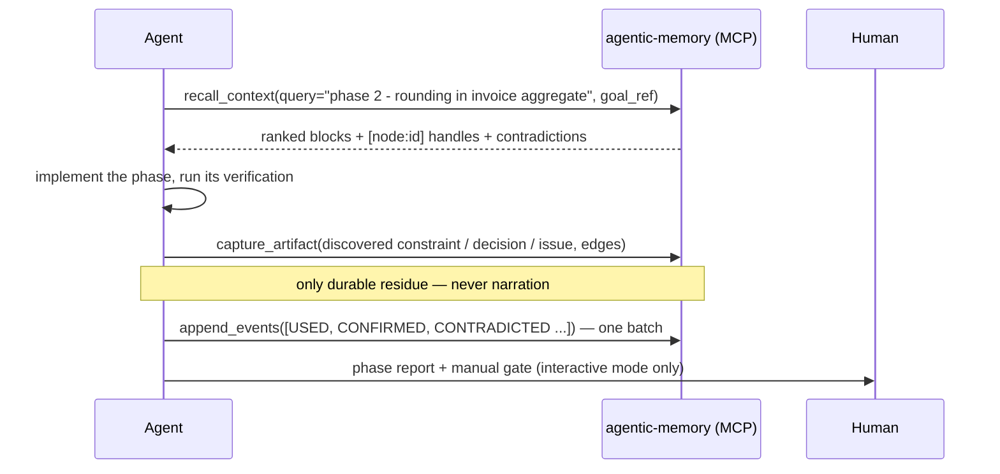
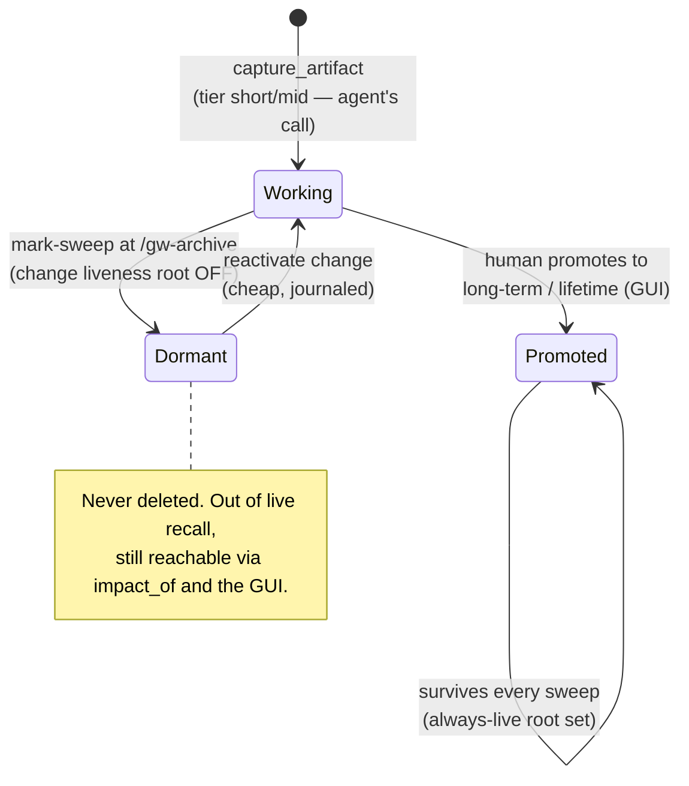
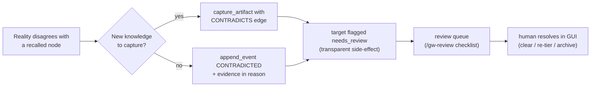
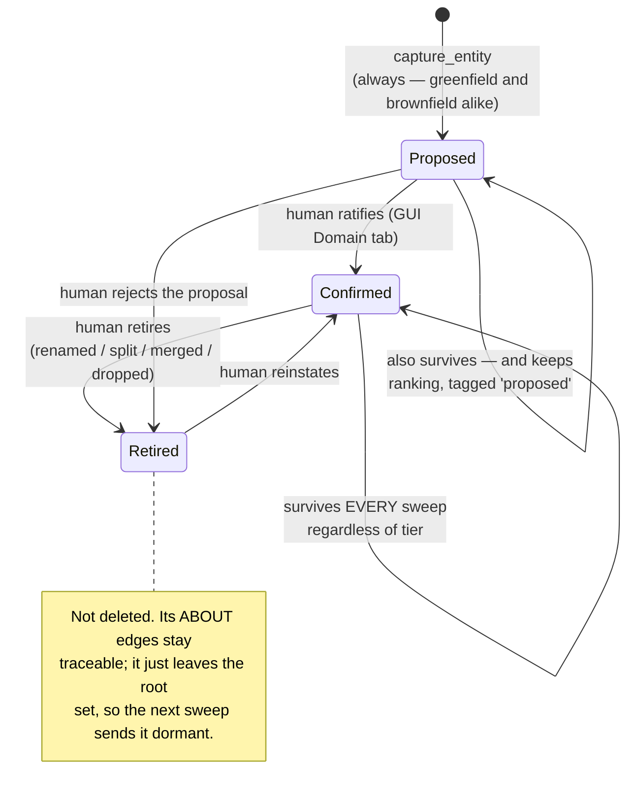

# graph-workflow — User Guide

*(Polska wersja: [USAGE.pl.md](USAGE.pl.md))*

This guide shows how to actually run the workflow day to day: setup, a worked
end-to-end change, headless runs, the review and archive gates — plus the edge
cases you will hit and the assumptions the whole design rests on.

Read the [README](../README.md) first for the one-page overview; this document is
the practitioner's manual.

---

## 1. The big picture

One lifecycle. Files carry *lifecycle state* (what a human or fresh agent needs to
find the work); the memory graph carries *knowledge* (what any future change needs
in order to not repeat or contradict this one).



Off the spine, and not change-shaped: `/gw-domain` (the ubiquitous language),
`/gw-ideate` (what to build next), `/gw-consolidate` (distil recurrence before the
sweep), `/gw-ask` (a question, no change), `/gw-resolve` (work the human queues).

---

## 2. Setup

### 2.1 Prerequisites

- [agentic-memory-system](https://github.com/mt3o-dev/agentic-memory-system)
  cloned and installed on PATH:
  `uv tool install --editable ~/tools/agentic-memory-system`
  (see the README's **Set up a project** for the full walkthrough).
- The MCP server registered with your agent client:

  ```sh
  # from your project root, so $PWD is the project:
  claude mcp add --scope project agentic-memory \
    --env MEMORY_DB_PATH="$PWD/context/memory-graph.db" -- agentic-memory-mcp
  ```

- The `gw-*` skills copied into `~/.claude/skills/` (user-wide) or
  `<project>/.claude/skills/`.

### 2.2 Initialize the project

```
/gw-init
```

This scaffolds the thin folder structure, verifies the MCP surface answers, and
appends the workflow snippet to the project's `CLAUDE.md`:

```
context/
  changes/     # active changes: <change-id>/{change.md, plan.md, research.md}
  archive/     # immutable — nothing ever writes here
  foundation/  # PRD, roadmap, tech-stack (human source of truth)
context/memory-graph.dump # the store as tracked text (the .db is a gitignored build artifact)
```

### 2.3 Load the foundation (brownfield or right after writing the PRD)

```
/gw-foundation
```

The skill opens a dedicated `foundation` memory scope and distills the documents'
**normative content** into nodes — not summaries, statements:

| From | Captured as | Example content |
|---|---|---|
| PRD non-negotiable | `constraint` | "Invoices are immutable after issue; corrections go through credit notes." |
| Domain term | `concept` | "An invoice aggregate owns its line items; totals are derived, never stored." |
| Tech-stack / ADR choice | `decision` | "Postgres over SQLite: PRD §3 requires concurrent writers." |
| Known accepted gap | `issue` | "No multi-currency support in v1; amounts assume PLN." |

Everything captured is handed to you as a **lifetime-promotion candidate list**.
Promote them in the GUI (`agentic-memory-gui`, run from the project root) — this is a
human-only action, and it is what puts foundation knowledge into the always-live
root set that every future recall draws from.

> **Why bother?** The graph starts empty. Without this step, the first ten
> changes run on recall bundles that know nothing, and agents re-derive (or
> contradict) the PRD from scratch.

### 2.4 Model the domain — `/gw-domain`

Foundation distillation captures the project's **claims**. This captures its
**nouns**, and they behave differently: a domain entity names something rather than
asserting something, so it cannot be contradicted (only renamed or retired), it never
decays, and it survives every sweep regardless of tier — the domain outlives the
changes that touch it.

Entities are also the graph's **hubs**. `ABOUT` is the one edge type whose *reverse*
direction is walked during retrieval, so once artifacts are attached to `Invoice`, a
later change working on invoices recalls them — including ones captured under a
different goal, in a change archived months ago. That is the difference between a
graph that answers *"what did this change decide?"* and one that answers *"what do we
know about invoices?"*.

Two modes, and the skill states which it is in before proposing anything:

| | **Greenfield** | **Brownfield** |
|---|---|---|
| Who authors the list | The user names the domain; the agent transcribes | The agent extracts from schema, core modules, PRD; the user reviews |
| Evidence recorded | The user's own words | `file:line` for every proposal |
| The agent's failure mode | Inventing entities — fiction the codebase then gets built to match | Proposing plumbing (`UserRepository`) as domain |
| The valuable output | A definition that says what the thing is **not** | The **drift findings**: synonyms, homonyms, code-only and talked-about-only terms |
| Who ratifies | **The human** | **The human** |

That last row is the same in both columns on purpose. `capture_entity` always lands
`proposed`; only a human confirms, in the GUI's **Domain** tab. An agent that
proposed and then confirmed its own proposal would not be a gate.

```
capture_entity(name="Customer",
               definition="A party we invoice. Not the person who logs in — that is a User.",
               goal_ref="node_7f3a",
               facets=["billing"],
               evidence="src/lib/core/model/customer.ts:14")
→ {node_id: "node_0a11", existing: false, status: "proposed"}
```

Recall then tags it: `[node:node_0a11] type=entity tier=short-term proposed`. Usable,
visibly unratified. Confirm it and the tag becomes `confirmed`.

Amendments (rename, split, merge, retire) run through the same skill — always with
`impact_of` first, because for an entity that returns everything written *about* it,
and a deep result means the rename is a project-level event rather than a tidy-up.

---

## 3. A worked example, end to end

Scenario: VAT on invoices is rounded per-invoice; tax guidance requires per-line
rounding. Project already initialized, foundation loaded.

### 3.1 Open the change — `/gw-new`

Agent settles the identity and creates both halves at once:

`context/changes/invoice-vat-rounding/change.md`:

```markdown
# invoice-vat-rounding

status: open
created: 2026-07-16

## Goal
Round VAT per line item (half-up) instead of per invoice, per 2025 tax guidance.

memory_goal: node_7f3a
```

Behind the scenes:

```
create_change(change_id="invoice-vat-rounding",
              goal="Round VAT per line item (half-up) instead of per invoice, per 2025 tax guidance.")
→ {change_node_id: "node_7f39", goal_node_id: "node_7f3a", activated: true}

recall_context(query="VAT rounding invoices", goal_ref="node_7f3a")
```

The seed recall returns ranked blocks — thanks to `/gw-foundation`, not empty:

```
[node:node_0012] (constraint, lifetime) Invoices are immutable after issue; corrections go through credit notes.
[node:node_0013] (concept, lifetime) An invoice aggregate owns its line items; totals are derived, never stored.
[node:node_0451] (decision, long-term, disputed) VAT is computed on the invoice total, then rounded half-up.
contradictions: node_0451 ↔ node_0562
```

Note the `disputed` tag — exactly the knowledge this change exists to overturn.

### 3.2 Plan — `/gw-plan`

The plan must supersede `node_0451`, so first the blast radius:

```
impact_of(node_ref="node_0451")
→ depth=1 [node:node_0788] (invariant) Grand total equals the sum of line totals.
  depth=2 [node:node_0790] (decision) Reports read totals from the invoice header.
```

Two dependents — not local, but bounded. The plan gets a risk entry for the
reports path. Then `plan.md` (phases + verification commands, thin) and the
plan-boundary capture:

```
capture_artifact(content="VAT is rounded half-up per line item; the invoice total is the sum of rounded line VATs. Supersedes invoice-level rounding.",
                 type="decision",
                 goal_ref="node_7f3a",
                 facets=["invoicing"],
                 edges=[{"target": "node_0451", "type": "CONTRADICTS", "direction": "out"},
                        {"target": "node_0013", "type": "DEPENDS_ON", "direction": "out"}],
                 tier="mid-term")
→ {node_id: "node_0801", side_effects: ["node_0451 flagged needs_review"]}
```

The CONTRADICTS edge *records* the conflict and flags the old decision for human
review. The agent never "deletes" the old knowledge — that is the safety model.

Before implementation, `/gw-plan-review` gates the plan: a **fresh session**
recalls the goal's settled constraints independently (not trusting the plan's own
citations as the universe of relevant knowledge) and checks the plan against
them — a silently violated constraint or an untraced supersession sends the plan
back to `/gw-plan`. Here it passes: the CONTRADICTS capture for `node_0451`
exists and the reports-path risk carries the `impact_of` result.

### 3.3 Implement — `/gw-implement`

Each phase runs the same loop:



Example phase-end feedback batch:

```
append_events([
  {"event_type": "USED",        "node_ref": "node_0801", "reason": "phase 2 implements this rounding"},
  {"event_type": "CONFIRMED",   "node_ref": "node_0788", "reason": "property test: grand total == sum of line totals"},
  {"event_type": "CONTRADICTED","node_ref": "node_0790", "reason": "reports read from a materialized view since migration 0042"}
])
```

`CONFIRMED` means *actively verified* (ran it, tested it) — stronger than `USED`;
don't inflate. The `CONTRADICTED` event flags `node_0790` for the review queue.

### 3.4 Review — `/gw-review`

`/gw-review` runs as a fresh session, so it first recalls the goal's settled
`constraint`/`invariant` nodes for the changed subsystems and reviews the diff
against them — a violated settled constraint is a request-changes finding. When
the code contradicts a constraint, the direction is a judgment call at review
time: either the code is wrong (fix it) or the constraint is now stale (record
`CONTRADICTED`, let it flag). Then two parts — code review against `plan.md` and
repo standards, and the **memory human gate**, written into the PR description:

```markdown
## Memory review (human gate)
Disputed nodes touched by this change:
- [node:node_0451] VAT computed on invoice total — contradicted by node_0801 (this change's core decision)
- [node:node_0790] reports read totals from invoice header — contradicted by evidence: migration 0042

Promotion candidates (CONFIRMED, look durable):
- [node:node_0801] per-line VAT rounding decision — change summary depends on it; suggest long-term
- [node:node_0812] change summary: "invoice-vat-rounding switched VAT to per-line half-up rounding…" — suggest long-term

Domain model: 2 entities awaiting ratification (Statement, Carrier).
Consolidation: 1 candidate — 3 changes have now captured "webhook handlers must be
idempotent". Run /gw-consolidate.

Open the review queue: `agentic-memory-gui` → Review tab.
```

`node_0812` is the **consolidation artifact** — one `concept` node distilling what
the change did and why, with `DEPENDS_ON` edges into its key decisions, `ABOUT` edges
to the entities the change touched, and `CONSOLIDATES` edges recording what it was
distilled from. Promote it and future recalls in this territory get the episode's
essence even after the detail goes dormant.

`CONSOLIDATES` is a **provenance channel only** — policy weight 0, so the retrieval
walker never crosses it. That is deliberate: the instances are dormant *on purpose*,
and walking the edge at query time would undo the sweep. It stays queryable in the
GUI and for provenance reads.

The last two lines are the newer gates. The **domain-model backlog** is entities an
agent proposed that nobody ratified — they still rank in recall tagged `proposed`, so
a growing backlog means the project's language is drifting agent-first. The
**consolidation** line reports `consolidation_candidates()`; the review only counts
them, it does not work them (that is `/gw-consolidate`, with the human).

### 3.5 Archive — `/gw-archive`

After merge:

```sh
uv run python scripts/memory_lifecycle.py deactivate invoice-vat-rounding --sweep
git mv context/changes/invoice-vat-rounding context/archive/invoice-vat-rounding
# one commit: folder move + note the sweep's node count
```

The sweep prints exactly which nodes went dormant. Promoted nodes
(`node_0801`, `node_0812`, the confirmed invariant) survive live.

---

## 4. Headless mode — `/gw-goal`

For bounded changes whose correctness a command can check. Same lifecycle
position as `/gw-implement`, different validity path:

```
recall → attempt → verify → (fail: diagnose, retry ≤ 3) → capture + journal → next phase
```

Hard preconditions — the skill refuses to start otherwise:

1. `plan.md` exists with a per-phase verification command.
2. `memory_goal` present in `change.md`.
3. The stop condition is checkable by a command, not by taste.

Headless-specific behavior:

- A `disputed` node that materially affects a phase is a **stop condition** — an
  unattended agent does not gamble on either side of a contradiction.
- Retries exhausted → capture an `issue` artifact with the failure evidence, set
  `status: blocked`, stop. A truthful partial result beats a flailing loop.
- Exit always emits a run report: phases done, verification results, captured
  `[node:id]` list, contradictions recorded. That report is what the human reads
  before `/gw-review`.

---

## 4a. Fixing a bug — `/gw-fix`

A fix is a change increment, not an errand: change-id, goal node, memory scope,
review, archive. What differs from `/gw-implement` is the **validity path** — a
feature is verified against a plan, a fix against a test that failed *before* the fix
existed.

```
/gw-new  →  invoice-vat-double-rounding
recall   →  [node:node_0788] (invariant, long-term) Grand total equals the sum of line totals.
            ↑ the invariant IS the bug report, stated precisely
reproduce → smallest input showing the wrong total; confirm with the user
impact_of → is the recorded rule right and the code wrong, or the other way round?
RED      →  write the failing test; RUN IT; paste the failure
GREEN    →  minimal change; new test passes; FULL suite passes
REFACTOR →  clean up, suite green after every step, no test edited
capture  →  the class of mistake, not the diff
```

Three rules carry most of the value:

- **No source edit before a red test.** If you cannot write a failing test, you have
  not understood the bug. "The fix is obvious" is exactly when this gets skipped and
  exactly when the regression returns.
- **The bug may be in the graph, not the code.** If the code faithfully implements a
  recorded rule that is itself wrong, the knowledge is the defect: capture the
  correction with a `CONTRADICTS` edge, and check `impact_of` first — a wrong rule
  with dependents means everything downstream was built on it.
- **Capture the class, not the instance.** "Money must not be rounded twice" is
  recallable by the next change; "line 44 of invoice.ts rounded twice" is git history.

Refactor mode inverts the loop honestly: no red step, so the safety net is coverage.
If the code has none, writing characterization tests *is* the first phase — a
refactor without a net is a rewrite with extra confidence.

Headless (`/gw-goal`) only when someone else already wrote the failing test:
reproduction is judgment, and an unattended agent that cannot reproduce will fix
something adjacent and report success.

## 4b. Designing a UI — `/gw-wireframe`

UI work fails the usual way: an agent generates plausible screens in one shot, the
user reacts to the finished thing, and the rework costs more than the design would
have. This skill trades that for a loop where the user redirects before any component
is written.

```
recall + domain_model()  →  UX constraints, a11y rules, the ratified nouns
detect design system     →  system-bound | library-bound | unstyled — declared out loud
screen inventory         →  ⏸ user agrees the LIST first (cheapest correction point)
per screen, one per turn →  layout sketch · component map · states · behavior
                            · constraints honored · ≤3 open questions  ⏸ wait
capture                  →  the structural decisions and the design-system rulings
→ /gw-plan
```

Two commitments make it part of this workflow rather than a generic design prompt:

- **The design system is law when one exists.** Wireframes name existing components
  and tokens. When a screen needs something the system lacks, that is surfaced as a
  decision with options and a cost each — never a silent one-off, which is how a
  design system dies.
- **Screens are made of domain entities.** Labels use ratified entity names. A term
  the domain model lacks is a `/gw-domain` proposal, not a word the UI coins.

Fidelity stops at structure and behavior. No hex codes, no font stacks — if the design
system defines them, cite the token; if it does not, that is a decision the project
has not made, and saying so beats guessing.

Empty and error states are wireframed explicitly or explicitly ruled out of scope.
They are where UI rework concentrates.

## 4c. Finding what to build next — `/gw-ideate`

Generic ideation produces what the team could have written themselves. This produces
the ideas **the project has already earned and not noticed** — because a
graph-workflow project accumulates a precise record of every problem it deferred and
every gap it accepted, filed one change at a time and never read together.

Six seams, mined as separate recalls:

| Seam | Yields |
|---|---|
| `issue` nodes | The backlog the team already agreed exists — highest confidence |
| Accepted gaps | Deferrals whose *reason* may have expired |
| Workarounds in constraints | Automation with the pain already documented |
| Under-used capability (`impact_of` returns little) | Already paid for, not yet collected on |
| Domain blind spots (entities with nothing `ABOUT` them) | Product areas the project named and never built |
| Recurring disputes in one territory | A model that does not fit reality |

**Evidence or cut.** Every surviving idea cites a `[node:<id>]`, a `file:line`, or a
user statement. Aim for 6–10 survivors, and report the cut list with reasons — a list
that survived nothing is a list nobody screened. Ideas go to
`context/foundation/roadmap.md`; only the *findings* (new gaps, blind spots, expired
deferrals) go into the graph.

## 4d. Consolidating — `/gw-consolidate`

When three changes independently discover the same thing, dormancy loses a real
pattern. Consolidation is how a pattern outlives its episodes.

```
consolidation_candidates()   →  ≥3 live artifacts, ≥2 distinct change scopes, shared facet
read the cluster             →  a real pattern | repetition | a false cluster?
draft the abstraction        →  must be true of cases NO instance covers
present to the human         →  they edit the sentence
POST /api/consolidate        →  their wording, their tier — you are the scribe
```

Strictly additive: it mints an abstraction and wires it. Nothing is edited, archived,
merged, or re-tiered — the instances go dormant on their own schedule, and the
abstraction stays live because a human promoted it.

The test that separates a real abstraction from a reworded instance: **is the draft
true of a case none of the instances cover?** If not, the cluster is repetition, which
is a different finding — it means recall is not serving what capture already wrote.

Do not consolidate domain entities. An entity is a referent, not an abstraction over
episodes; several entities that look like one is a *merge*, and that is `/gw-domain`.

## 5. How knowledge lives and dies



And the contradiction path — the only way "wrong" knowledge gets handled:



The agent records that a conflict exists; it never decides who wins. Trust is
folded from the journal by privileged maintenance — no agent call can set it.

Domain entities live by different physics — an identity ladder rather than a validity
one, and liveness by class rather than by tier:



Note what the two self-loops mean together: an unratified entity is **not** harmless
waiting. It survives sweeps and keeps ranking in recall, tagged `proposed` — so a
careless proposal outlives every change that could have corrected it, and a good one
never becomes settled vocabulary. That is why `/gw-review` reports the backlog count
at every PR.

---

## 6. Edge cases

**Memory server down / not registered.** The workflow degrades to plain 10x
files — but the memory discipline queues instead of stopping: append every
would-be operation (create_change parameters, captures with type/edges/facets,
events, promotion candidates) to `context/changes/<id>/memory-backlog.md`, and
replay the backlog against the MCP surface when it returns. Gates read the
backlog as the stand-in graph; foundation docs serve as the recalled constraint
set. A capture made only against a dead server never happened — the backlog is
what makes it recoverable.

**`change.md` has no `memory_goal`.** Someone opened the change by hand. Run
`/gw-new`'s scope steps (`create_change` + record the id) before capturing
anything — `capture_artifact` rejects goal-less writes by design.

**`create_change` says the change already exists.** Don't mint another. Recover
the goal id from `change.md`; if the file lost it, the change node lives at
`/change/<change-id>` — find it in the GUI.

**Seed recall comes back (nearly) empty.** On a young store this is correct, not
a failure. If it stays empty on a mature store, your query wording missed the
graph's vocabulary — retry with domain terms (facet names, concept labels).

**A recalled node is `disputed`.** Interactive: reason with both sides in your
plan/analysis, explicitly, and say which side you build on. Headless: stop
condition — leave it for the PR gate.

**`facet_warnings` on capture.** The vocabulary guard found a near-synonym
("did you mean `invoicing`?"). Decide deliberately: re-call with the suggested
facet, or keep yours because it genuinely is distinct. Never ignore it silently —
facet drift splits the graph.

**The sweep archived something you expected to survive.** It was never promoted
past short-term. Reactivate (`memory_lifecycle.py activate <change-id>`), have
the human promote it in the GUI, deactivate again. Do not edit the store by hand.

**Any write path resolves under `context/archive/`.** Abort, always, with:
*"This change is archived. Open a new change with /gw-new."* Follow-up work gets
a new change with `parent_refs` pointing at the old change's surviving nodes.

**Two parallel changes contradict each other.** They share one store, so the
second agent's recall *will* surface the first agent's fresh decision — usually
as a `disputed` pair once a CONTRADICTS edge lands. That's the system working:
the conflict reaches the review queue instead of merging silently. Parallelism
stays capped by review capacity for exactly this reason.

**A recalled entity is tagged `proposed`.** An agent named it; no human ratified it.
Use it, and say you did — the name is provisional. If the work depends on it being
right, route the ratification to `/gw-resolve` or the GUI Domain tab first.

**`capture_entity` says the entity already exists.** Correct and idempotent: the name
is the key. It returns the existing node and does **not** overwrite the definition.

**You disagree with an existing definition.** Note that a `CONTRADICTS` edge touching an
entity is *rejected*: an entity asserts nothing, so nothing can contradict it. Two
channels do apply — capture the correction as a `concept` with an `ABOUT` edge to the
entity, and `append_event("CONTRADICTED", <entity-id>)` with your evidence, which flags
it for the human who renames, redefines, or retires it. Never redefine the domain
silently mid-change.

**`entity_warnings` on capture ("close to existing entity `Customer`").** Unlike a
facet warning, the entity was still created. That asymmetry is deliberate: entities
have a human ratification gate, and "is `Client` the same as `Customer`?" is an
identity question a person should answer while looking at both definitions. The
warning is carried into the proposal's journal entry, so the gate sees it.

**An entity was retired but its artifacts are still attached.** Retiring strands them:
they lose the hub that made them findable across changes. Re-attach with `ABOUT` to
the replacement entity *before* the human retires the old one — `/gw-domain` §C
sequences all four amendment moves this way.

**The sweep archived an entity.** Only two ways: it was retired, or it was never an
entity (a `concept` node about a domain term is scope-bound like any other artifact).
Check `domain_model(status="all")` — if the name is absent, it was captured as an
artifact and needs a real entity.

**`consolidation_candidates()` keeps returning the same cluster.** It should not — a
consolidated instance is excluded by construction. If it recurs, the consolidation was
never committed (drafted, then the human never ruled). If the cluster is *repetition*
rather than a pattern, say so explicitly and route the finding: repeated near-identical
captures mean recall is not serving what capture already wrote.

**A bug fix has no reproducible test.** Then it is not ready for `/gw-fix`. Capture an
`issue` with what you established and what you ruled out, and stop. A speculative fix
is indistinguishable from a new bug, and the test is the only thing that makes the fix
verifiable at review.

**Headless run exhausted its retries.** Expect `status: blocked`, an `issue`
node with the evidence, and a run report. Triage: fix the plan (usually) or the
verification command (sometimes), then re-run under the same change-id.

**Abandoned change.** Still close it properly: capture the lessons (often the
most valuable `issue`/`constraint` nodes come from failures), journal, then
`/gw-archive` with `status: abandoned` in `change.md`. The sweep makes its noise
dormant; the lessons survive if promoted.

**Foundation document amended.** This is a change like any other, plus the
amendment flow: recall the foundation subgraph, `impact_of` the nodes the edit
invalidates (foundation nodes have the widest blast radius in the store — a deep
result is a project-level decision), capture new statements with CONTRADICTS
edges, and let the human re-promote. Never sync doc→graph silently.

**Sharing the store in a team.** `context/memory-graph.dump` is tracked plain text;
the `.db` is gitignored and rebuilt from it. Nothing to run before push or after
pull — the store refreshes the dump on close and rebuilds itself on open.

When a merge conflicts in the dump, run **`agentic-memory sync resolve`** and `git add`
the result: it merges the two sides by id, which for two people adding different things
means keeping both. Do *not* delete the markers by hand — git aligns blocks that look
alike and reports only their differing lines, so "keep both sides" can splice half of
one node or event onto half of another, and the result parses without complaint. You
cannot miss the conflict by accident: memory commands refuse to run against a conflicted
dump rather than answering from a half-loaded graph, and refuse to overwrite one rather
than silently discarding the other side.

Two people writing one `.db` concurrently is still undefined — the dump is the merge
surface, as it always was, just without a filter to register.

---

## 7. Assumptions and limits

1. **One store per project**, at `context/memory-graph.db`, owned by the MCP
   server. Pointing a shared store at two projects poisons both.
2. **A human exists.** Flag resolution, tier promotion, and the review gate are
   human-only by design. Fully unattended pipelines can run `/gw-goal`, but
   nothing gets promoted and disputes accumulate until a human works the queue.
3. **Review capacity is the throughput cap.** More parallel agents without
   review means more unreviewed code *and* an unworked review queue.
4. **The agent surface cannot do damage** — no trust mutation, no flag clearing,
   no promotion, no archival, no entity ratification, no consolidation commit. If a
   workflow step seems to need one of those, the step is wrong, not the surface.
   Agents propose, detect, draft, and recommend; each of those ends at a person.
5. **Capture quality is the ceiling.** Retrieval is deterministic (same graph +
   same query → same ranking; no LLM in the query path), so what recall serves
   is exactly as good as what capture wrote. One cold-readable statement per
   node, edges named at capture time.
6. **Feedback is mandatory**, one batch per phase/session. Unreported sessions
   are invisible to ranking — the graph slowly stops serving what you actually
   use.
7. **`uv` and the memory repo** are reachable from the project for lifecycle
   script calls (`memory_lifecycle.py`) and the GUI.
8. **Facet vocabulary is controlled.** New facets are a deliberate act, guarded
   by the collision detector — not a free-text tag cloud.
9. **plan.md is sequencing, not knowledge.** It may die with the change; the
   decisions it embodied were captured at the plan boundary and live on. The same
   holds for `research.md` and `wireframes.md`.
10. **Domain modelling needs a human in the loop, in both modes.** Greenfield is an
    interview; brownfield is a review. Neither runs unattended — an unattended
    greenfield pass invents the domain, and an unattended brownfield pass ratifies
    the codebase's structure as if it were the domain.
11. **The domain model is a quality multiplier, not a prerequisite.** The workflow
    runs without it; recall is just narrower, because nothing links artifacts across
    change boundaries except the goal cone and embedding luck.
