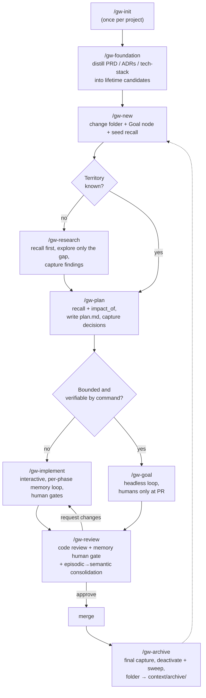
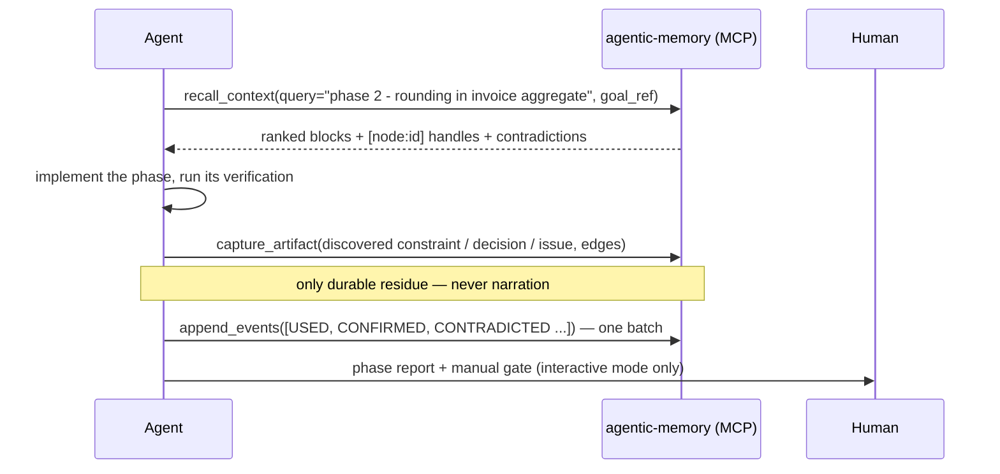
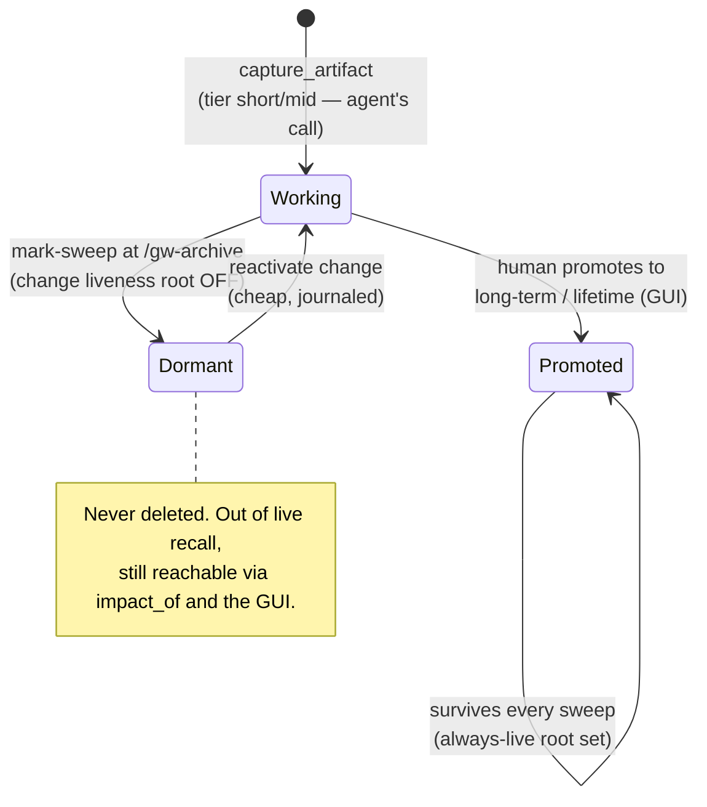
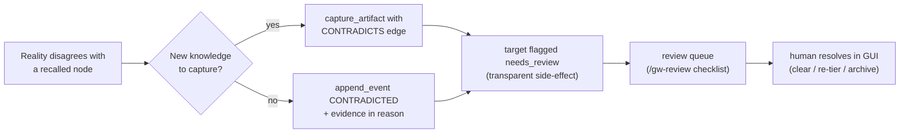

# graph-workflow — User Guide

*(Polska wersja: [USAGE.pl.md](USAGE.pl.md))*

This guide shows how to actually run the workflow day to day: setup, a worked
end-to-end change, headless runs, the review and archive gates — plus the edge
cases you will hit and the assumptions the whole design rests on.

Read the [README](../README.md) first for the one-page overview; this document is
the practitioner's manual.

---

## 1. The big picture

One lifecycle. Files carry *lifecycle state* (what a human or fresh agent needs to
find the work); the memory graph carries *knowledge* (what any future change needs
in order to not repeat or contradict this one).



---

## 2. Setup

### 2.1 Prerequisites

- [agentic-memory-system](https://github.com/mt3o-dev/agentic-memory-system)
  cloned somewhere, with `uv` available.
- The MCP server registered with your agent client:

  ```sh
  claude mcp add agentic-memory -- uv run --directory /path/to/agentic-memory-system agentic-memory-mcp
  ```

- The `gw-*` skills copied into `~/.claude/skills/` (user-wide) or
  `<project>/.claude/skills/`.

### 2.2 Initialize the project

```
/gw-init
```

This scaffolds the thin folder structure, verifies the MCP surface answers, and
appends the workflow snippet to the project's `CLAUDE.md`:

```
context/
  changes/     # active changes: <change-id>/{change.md, plan.md, research.md}
  archive/     # immutable — nothing ever writes here
  foundation/  # PRD, roadmap, tech-stack (human source of truth)
context/memory-graph.db   # the store — gitignored, synced via dump/restore
```

### 2.3 Load the foundation (brownfield or right after writing the PRD)

```
/gw-foundation
```

The skill opens a dedicated `foundation` memory scope and distills the documents'
**normative content** into nodes — not summaries, statements:

| From | Captured as | Example content |
|---|---|---|
| PRD non-negotiable | `constraint` | "Invoices are immutable after issue; corrections go through credit notes." |
| Domain term | `concept` | "An invoice aggregate owns its line items; totals are derived, never stored." |
| Tech-stack / ADR choice | `decision` | "Postgres over SQLite: PRD §3 requires concurrent writers." |
| Known accepted gap | `issue` | "No multi-currency support in v1; amounts assume PLN." |

Everything captured is handed to you as a **lifetime-promotion candidate list**.
Promote them in the GUI (`uv run agentic-memory-gui` → tier controls) — this is a
human-only action, and it is what puts foundation knowledge into the always-live
root set that every future recall draws from.

> **Why bother?** The graph starts empty. Without this step, the first ten
> changes run on recall bundles that know nothing, and agents re-derive (or
> contradict) the PRD from scratch.

---

## 3. A worked example, end to end

Scenario: VAT on invoices is rounded per-invoice; tax guidance requires per-line
rounding. Project already initialized, foundation loaded.

### 3.1 Open the change — `/gw-new`

Agent settles the identity and creates both halves at once:

`context/changes/invoice-vat-rounding/change.md`:

```markdown
# invoice-vat-rounding

status: open
created: 2026-07-16

## Goal
Round VAT per line item (half-up) instead of per invoice, per 2025 tax guidance.

memory_goal: node_7f3a
```

Behind the scenes:

```
create_change(change_id="invoice-vat-rounding",
              goal="Round VAT per line item (half-up) instead of per invoice, per 2025 tax guidance.")
→ {change_node_id: "node_7f39", goal_node_id: "node_7f3a", activated: true}

recall_context(query="VAT rounding invoices", goal_ref="node_7f3a")
```

The seed recall returns ranked blocks — thanks to `/gw-foundation`, not empty:

```
[node:node_0012] (constraint, lifetime) Invoices are immutable after issue; corrections go through credit notes.
[node:node_0013] (concept, lifetime) An invoice aggregate owns its line items; totals are derived, never stored.
[node:node_0451] (decision, long-term, disputed) VAT is computed on the invoice total, then rounded half-up.
contradictions: node_0451 ↔ node_0562
```

Note the `disputed` tag — exactly the knowledge this change exists to overturn.

### 3.2 Plan — `/gw-plan`

The plan must supersede `node_0451`, so first the blast radius:

```
impact_of(node_ref="node_0451")
→ depth=1 [node:node_0788] (invariant) Grand total equals the sum of line totals.
  depth=2 [node:node_0790] (decision) Reports read totals from the invoice header.
```

Two dependents — not local, but bounded. The plan gets a risk entry for the
reports path. Then `plan.md` (phases + verification commands, thin) and the
plan-boundary capture:

```
capture_artifact(content="VAT is rounded half-up per line item; the invoice total is the sum of rounded line VATs. Supersedes invoice-level rounding.",
                 type="decision",
                 goal_ref="node_7f3a",
                 facets=["invoicing"],
                 edges=[{"target": "node_0451", "type": "CONTRADICTS", "direction": "out"},
                        {"target": "node_0013", "type": "DEPENDS_ON", "direction": "out"}],
                 tier="mid-term")
→ {node_id: "node_0801", side_effects: ["node_0451 flagged needs_review"]}
```

The CONTRADICTS edge *records* the conflict and flags the old decision for human
review. The agent never "deletes" the old knowledge — that is the safety model.

### 3.3 Implement — `/gw-implement`

Each phase runs the same loop:



Example phase-end feedback batch:

```
append_events([
  {"event_type": "USED",        "node_ref": "node_0801", "reason": "phase 2 implements this rounding"},
  {"event_type": "CONFIRMED",   "node_ref": "node_0788", "reason": "property test: grand total == sum of line totals"},
  {"event_type": "CONTRADICTED","node_ref": "node_0790", "reason": "reports read from a materialized view since migration 0042"}
])
```

`CONFIRMED` means *actively verified* (ran it, tested it) — stronger than `USED`;
don't inflate. The `CONTRADICTED` event flags `node_0790` for the review queue.

### 3.4 Review — `/gw-review`

Two parts. Code review against `plan.md` and repo standards — and the **memory
human gate**, written into the PR description:

```markdown
## Memory review (human gate)
Disputed nodes touched by this change:
- [node:node_0451] VAT computed on invoice total — contradicted by node_0801 (this change's core decision)
- [node:node_0790] reports read totals from invoice header — contradicted by evidence: migration 0042

Promotion candidates (CONFIRMED, look durable):
- [node:node_0801] per-line VAT rounding decision — change summary depends on it; suggest long-term
- [node:node_0812] change summary: "invoice-vat-rounding switched VAT to per-line half-up rounding…" — suggest long-term

Open the review queue: `uv run agentic-memory-gui` → Review tab.
```

`node_0812` is the **consolidation artifact** — one `concept` node distilling what
the change did and why, with `DEPENDS_ON` edges into its key decisions. Promote it
and future recalls in this territory get the episode's essence even after the
detail goes dormant.

### 3.5 Archive — `/gw-archive`

After merge:

```sh
uv run python scripts/memory_lifecycle.py deactivate invoice-vat-rounding --sweep
git mv context/changes/invoice-vat-rounding context/archive/invoice-vat-rounding
# one commit: folder move + note the sweep's node count
```

The sweep prints exactly which nodes went dormant. Promoted nodes
(`node_0801`, `node_0812`, the confirmed invariant) survive live.

---

## 4. Headless mode — `/gw-goal`

For bounded changes whose correctness a command can check. Same lifecycle
position as `/gw-implement`, different validity path:

```
recall → attempt → verify → (fail: diagnose, retry ≤ 3) → capture + journal → next phase
```

Hard preconditions — the skill refuses to start otherwise:

1. `plan.md` exists with a per-phase verification command.
2. `memory_goal` present in `change.md`.
3. The stop condition is checkable by a command, not by taste.

Headless-specific behavior:

- A `disputed` node that materially affects a phase is a **stop condition** — an
  unattended agent does not gamble on either side of a contradiction.
- Retries exhausted → capture an `issue` artifact with the failure evidence, set
  `status: blocked`, stop. A truthful partial result beats a flailing loop.
- Exit always emits a run report: phases done, verification results, captured
  `[node:id]` list, contradictions recorded. That report is what the human reads
  before `/gw-review`.

---

## 5. How knowledge lives and dies



And the contradiction path — the only way "wrong" knowledge gets handled:



The agent records that a conflict exists; it never decides who wins. Trust is
folded from the journal by privileged maintenance — no agent call can set it.

---

## 6. Edge cases

**Memory server down / not registered.** The workflow degrades to plain 10x —
files only. Captures are *lost, not queued*: don't run knowledge-heavy phases
(research, plan boundaries) until it's back. `gw-init` tells you the surface is
dead; believe it.

**`change.md` has no `memory_goal`.** Someone opened the change by hand. Run
`/gw-new`'s scope steps (`create_change` + record the id) before capturing
anything — `capture_artifact` rejects goal-less writes by design.

**`create_change` says the change already exists.** Don't mint another. Recover
the goal id from `change.md`; if the file lost it, the change node lives at
`/change/<change-id>` — find it in the GUI.

**Seed recall comes back (nearly) empty.** On a young store this is correct, not
a failure. If it stays empty on a mature store, your query wording missed the
graph's vocabulary — retry with domain terms (facet names, concept labels).

**A recalled node is `disputed`.** Interactive: reason with both sides in your
plan/analysis, explicitly, and say which side you build on. Headless: stop
condition — leave it for the PR gate.

**`facet_warnings` on capture.** The vocabulary guard found a near-synonym
("did you mean `invoicing`?"). Decide deliberately: re-call with the suggested
facet, or keep yours because it genuinely is distinct. Never ignore it silently —
facet drift splits the graph.

**The sweep archived something you expected to survive.** It was never promoted
past short-term. Reactivate (`memory_lifecycle.py activate <change-id>`), have
the human promote it in the GUI, deactivate again. Do not edit the store by hand.

**Any write path resolves under `context/archive/`.** Abort, always, with:
*"This change is archived. Open a new change with /gw-new."* Follow-up work gets
a new change with `parent_refs` pointing at the old change's surviving nodes.

**Two parallel changes contradict each other.** They share one store, so the
second agent's recall *will* surface the first agent's fresh decision — usually
as a `disputed` pair once a CONTRADICTS edge lands. That's the system working:
the conflict reaches the review queue instead of merging silently. Parallelism
stays capped by review capacity for exactly this reason.

**Headless run exhausted its retries.** Expect `status: blocked`, an `issue`
node with the evidence, and a run report. Triage: fix the plan (usually) or the
verification command (sometimes), then re-run under the same change-id.

**Abandoned change.** Still close it properly: capture the lessons (often the
most valuable `issue`/`constraint` nodes come from failures), journal, then
`/gw-archive` with `status: abandoned` in `change.md`. The sweep makes its noise
dormant; the lessons survive if promoted.

**Foundation document amended.** This is a change like any other, plus the
amendment flow: recall the foundation subgraph, `impact_of` the nodes the edit
invalidates (foundation nodes have the widest blast radius in the store — a deep
result is a project-level decision), capture new statements with CONTRADICTS
edges, and let the human re-promote. Never sync doc→graph silently.

**Sharing the store in a team.** The SQLite file is gitignored; the sync format
is the legible dump (`scripts/dump_db.py` / `restore_db.py`). Dump before push,
restore after pull. Two people writing the binary concurrently is undefined —
treat the dump as the merge surface.

---

## 7. Assumptions and limits

1. **One store per project**, at `context/memory-graph.db`, owned by the MCP
   server. Pointing a shared store at two projects poisons both.
2. **A human exists.** Flag resolution, tier promotion, and the review gate are
   human-only by design. Fully unattended pipelines can run `/gw-goal`, but
   nothing gets promoted and disputes accumulate until a human works the queue.
3. **Review capacity is the throughput cap.** More parallel agents without
   review means more unreviewed code *and* an unworked review queue.
4. **The agent surface cannot do damage** — no trust mutation, no flag clearing,
   no promotion, no archival. If a workflow step seems to need one of those,
   the step is wrong, not the surface.
5. **Capture quality is the ceiling.** Retrieval is deterministic (same graph +
   same query → same ranking; no LLM in the query path), so what recall serves
   is exactly as good as what capture wrote. One cold-readable statement per
   node, edges named at capture time.
6. **Feedback is mandatory**, one batch per phase/session. Unreported sessions
   are invisible to ranking — the graph slowly stops serving what you actually
   use.
7. **`uv` and the memory repo** are reachable from the project for lifecycle
   script calls (`memory_lifecycle.py`) and the GUI.
8. **Facet vocabulary is controlled.** New facets are a deliberate act, guarded
   by the collision detector — not a free-text tag cloud.
9. **plan.md is sequencing, not knowledge.** It may die with the change; the
   decisions it embodied were captured at the plan boundary and live on.
