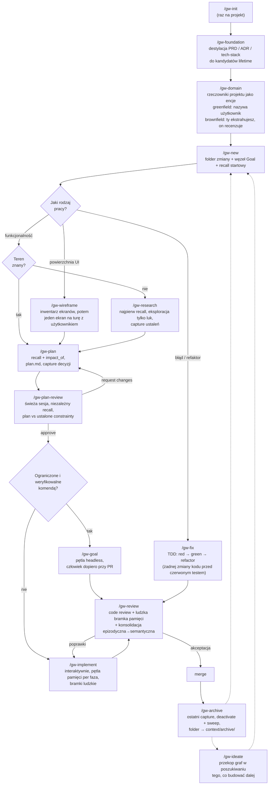
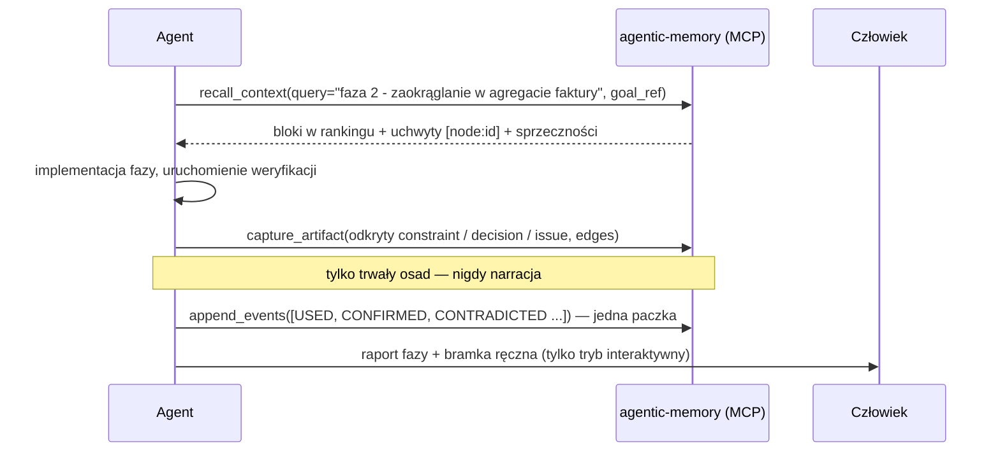
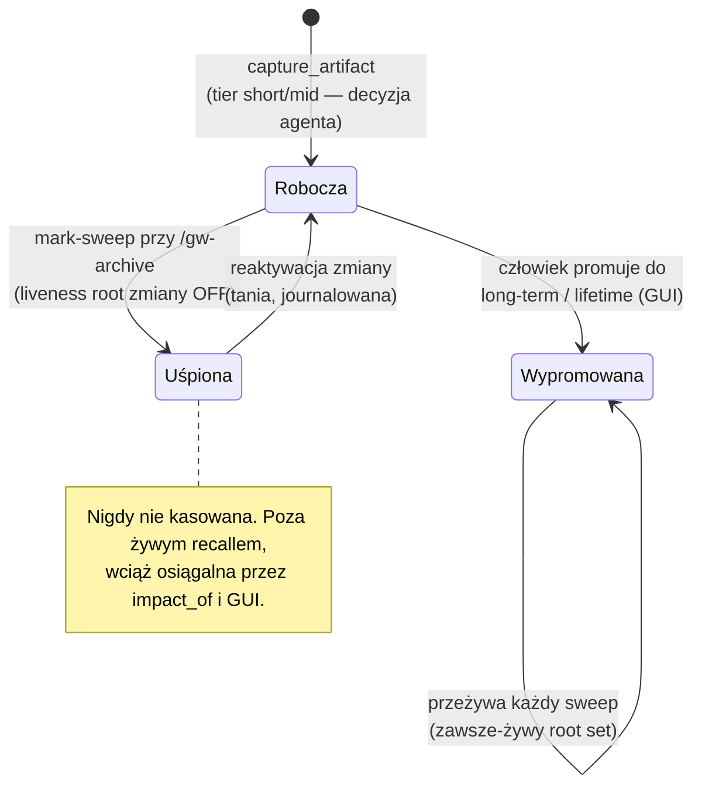
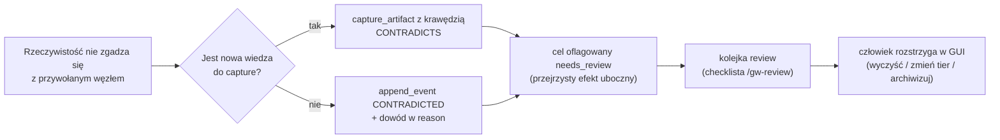
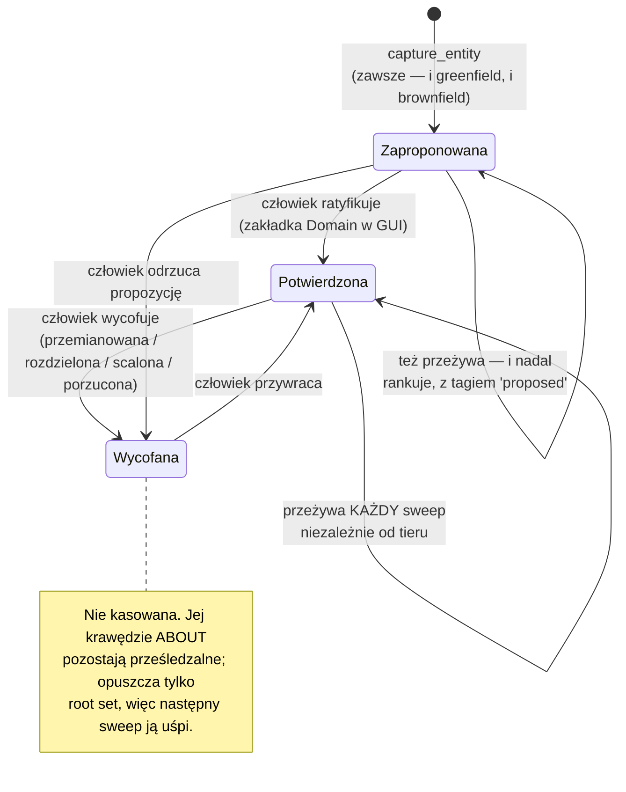

# graph-workflow — Przewodnik użytkownika

*(English version: [USAGE.en.md](USAGE.en.md))*

Ten przewodnik pokazuje, jak używać workflow na co dzień: konfiguracja, pełny
przykład zmiany od początku do końca, tryb headless, bramki review i archiwizacji
— plus przypadki brzegowe, na które trafisz, i założenia, na których opiera się
cały projekt.

Najpierw przeczytaj [README](../README.md) (jednostronicowy przegląd); ten
dokument to podręcznik praktyka.

---

## 1. Szeroki obraz

Jeden cykl życia. Pliki niosą *stan cyklu życia* (to, czego człowiek lub świeży
agent potrzebuje, żeby odnaleźć pracę); graf pamięci niesie *wiedzę* (to, czego
każda przyszła zmiana potrzebuje, żeby nie powtórzyć ani nie zaprzeczyć tej
obecnej).



Poza główną osią, poza kształtem zmiany: `/gw-domain` (język wszechobecny),
`/gw-ideate` (co budować dalej), `/gw-consolidate` (destylacja powtarzalności zanim
sweep uśpi szczegóły), `/gw-ask` (pytanie bez zmiany), `/gw-resolve` (praca nad
ludzkimi kolejkami).

---

## 2. Konfiguracja

### 2.1 Wymagania wstępne

- Sklonowany [agentic-memory-system](https://github.com/mt3o-dev/agentic-memory-system),
  dostępne `uv`.
- Serwer MCP zarejestrowany w kliencie agenta:

  ```sh
  claude mcp add agentic-memory -- uv run --directory /path/to/agentic-memory-system agentic-memory-mcp
  ```

- Skille `gw-*` skopiowane do `~/.claude/skills/` (globalnie) lub
  `<projekt>/.claude/skills/`.

### 2.2 Inicjalizacja projektu

```
/gw-init
```

Tworzy cienką strukturę folderów, weryfikuje że powierzchnia MCP odpowiada
i dokleja snippet workflow do `CLAUDE.md` projektu:

```
context/
  changes/     # aktywne zmiany: <change-id>/{change.md, plan.md, research.md}
  archive/     # niemutowalne — nic tu nigdy nie pisze
  foundation/  # PRD, roadmapa, tech-stack (ludzkie źródło prawdy)
context/memory-graph.dump # store jako śledzony tekst (.db to artefakt lokalny, w .gitignore)
```

### 2.3 Załadowanie fundamentów (brownfield albo zaraz po napisaniu PRD)

```
/gw-foundation
```

Skill otwiera dedykowany zakres pamięci `foundation` i destyluje **treść
normatywną** dokumentów do węzłów — nie streszczenia, lecz stwierdzenia:

| Skąd | Typ węzła | Przykładowa treść |
|---|---|---|
| Niepodważalne z PRD | `constraint` | „Faktury po wystawieniu są niemutowalne; korekty przez noty korygujące." |
| Pojęcie domenowe | `concept` | „Agregat faktury jest właścicielem pozycji; sumy są wyliczane, nigdy przechowywane." |
| Wybór tech-stack / ADR | `decision` | „Postgres zamiast SQLite: PRD §3 wymaga równoległych zapisów." |
| Znana, zaakceptowana luka | `issue` | „Brak wielowalutowości w v1; kwoty zakładają PLN." |

Wszystko, co zostało zcapture'owane, dostajesz jako **listę kandydatów do
promocji lifetime**. Promuj w GUI (`uv run agentic-memory-gui` → kontrolki
tierów) — to działanie wyłącznie ludzkie i to właśnie ono umieszcza wiedzę
fundamentową w zawsze-żywym root secie, z którego czerpie każdy przyszły recall.

> **Po co to?** Graf startuje pusty. Bez tego kroku pierwsze dziesięć zmian
> działa na recallach, które nic nie wiedzą, a agenci wyprowadzają (albo
> naruszają) PRD od zera.

### 2.4 Modelowanie domeny — `/gw-domain`

Destylacja fundamentów zbiera **twierdzenia** projektu. Ten krok zbiera jego
**rzeczowniki**, a te zachowują się inaczej: encja domenowa *nazywa*, a nie
*twierdzi*, więc nie da się jej zaprzeczyć (można ją tylko przemianować albo
wycofać), nigdy nie ulega rozpadowi i przeżywa każdy sweep niezależnie od tieru —
domena przeżywa zmiany, które jej dotykają.

Encje są też **hubami** grafu. `ABOUT` to jedyny typ krawędzi, którego kierunek
*odwrotny* jest przechodzony przy wyszukiwaniu, więc gdy artefakty zostaną podpięte
do `Invoice`, późniejsza zmiana pracująca nad fakturami dostanie je w recallu — także
te zcapture'owane pod innym celem, w zmianie zarchiwizowanej wiele miesięcy temu. To
różnica między grafem, który odpowiada na *„co ustaliła ta zmiana?"*, a takim, który
odpowiada na *„co wiemy o fakturach?"*.

Dwa tryby; skill mówi wprost, w którym jest, zanim cokolwiek zaproponuje:

| | **Greenfield** | **Brownfield** |
|---|---|---|
| Kto tworzy listę | Użytkownik nazywa domenę, agent zapisuje | Agent ekstrahuje ze schematu, modułów core, PRD; użytkownik recenzuje |
| Zapisany dowód | Własne słowa użytkownika | `plik:linia` przy każdej propozycji |
| Tryb porażki agenta | Wymyślanie encji — fikcja, pod którą potem powstaje kod | Proponowanie hydrauliki (`UserRepository`) jako domeny |
| Wartościowy wynik | Definicja mówiąca, czym rzecz **nie jest** | **Ustalenia o rozjeździe**: synonimy, homonimy, terminy tylko-w-kodzie i tylko-w-mowie |
| Kto ratyfikuje | **Człowiek** | **Człowiek** |

Ostatni wiersz jest celowo identyczny. `capture_entity` zawsze ląduje jako
`proposed`; potwierdza wyłącznie człowiek, w zakładce **Domain** w GUI. Agent, który
proponuje i sam zatwierdza własną propozycję, nie jest żadną bramką.

```
capture_entity(name="Customer",
               definition="Strona, którą fakturujemy. Nie osoba, która się loguje — to User.",
               goal_ref="node_7f3a",
               facets=["billing"],
               evidence="src/lib/core/model/customer.ts:14")
→ {node_id: "node_0a11", existing: false, status: "proposed"}
```

Recall następnie taguje ją: `[node:node_0a11] type=entity tier=short-term proposed`.
Użyteczna, widocznie nieratyfikowana. Po potwierdzeniu tag zmienia się na `confirmed`.

Poprawki (przemianowanie, rozdzielenie, scalenie, wycofanie) idą przez ten sam skill —
zawsze z `impact_of` na początku, bo dla encji zwraca on wszystko, co o niej napisano,
a głęboki wynik oznacza, że przemianowanie jest wydarzeniem na poziomie projektu, a nie
porządkami.

---

## 3. Pełny przykład od początku do końca

Scenariusz: VAT na fakturach zaokrąglany jest per faktura; wytyczne podatkowe
wymagają zaokrąglania per pozycja. Projekt zainicjalizowany, fundamenty
załadowane.

### 3.1 Otwarcie zmiany — `/gw-new`

Agent ustala tożsamość i tworzy obie połowy naraz:

`context/changes/invoice-vat-rounding/change.md`:

```markdown
# invoice-vat-rounding

status: open
created: 2026-07-16

## Goal
Zaokrąglać VAT per pozycja (half-up) zamiast per faktura, zgodnie z wytycznymi 2025.

memory_goal: node_7f3a
```

Za kulisami:

```
create_change(change_id="invoice-vat-rounding",
              goal="Zaokrąglać VAT per pozycja (half-up) zamiast per faktura, zgodnie z wytycznymi 2025.")
→ {change_node_id: "node_7f39", goal_node_id: "node_7f3a", activated: true}

recall_context(query="zaokrąglanie VAT faktury", goal_ref="node_7f3a")
```

Recall startowy zwraca bloki w rankingu — dzięki `/gw-foundation` nie jest pusty:

```
[node:node_0012] (constraint, lifetime) Faktury po wystawieniu są niemutowalne; korekty przez noty korygujące.
[node:node_0013] (concept, lifetime) Agregat faktury jest właścicielem pozycji; sumy są wyliczane, nigdy przechowywane.
[node:node_0451] (decision, long-term, disputed) VAT liczony od sumy faktury, potem zaokrąglany half-up.
contradictions: node_0451 ↔ node_0562
```

Zwróć uwagę na tag `disputed` — to dokładnie ta wiedza, którą ta zmiana ma
obalić.

### 3.2 Plan — `/gw-plan`

Plan ma zastąpić `node_0451`, więc najpierw promień rażenia:

```
impact_of(node_ref="node_0451")
→ depth=1 [node:node_0788] (invariant) Suma faktury równa się sumie sum pozycji.
  depth=2 [node:node_0790] (decision) Raporty czytają sumy z nagłówka faktury.
```

Dwa zależne węzły — zmiana nie jest lokalna, ale jest ograniczona. Plan dostaje
wpis ryzyka dla ścieżki raportów. Potem `plan.md` (fazy + komendy weryfikacji,
cienko) i capture na granicy planu:

```
capture_artifact(content="VAT zaokrąglany half-up per pozycja; suma faktury to suma zaokrąglonych VAT-ów pozycji. Zastępuje zaokrąglanie na poziomie faktury.",
                 type="decision",
                 goal_ref="node_7f3a",
                 facets=["invoicing"],
                 edges=[{"target": "node_0451", "type": "CONTRADICTS", "direction": "out"},
                        {"target": "node_0013", "type": "DEPENDS_ON", "direction": "out"}],
                 tier="mid-term")
→ {node_id: "node_0801", side_effects: ["node_0451 flagged needs_review"]}
```

Krawędź CONTRADICTS *rejestruje* konflikt i flaguje starą decyzję do ludzkiego
review. Agent nigdy nie „kasuje" starej wiedzy — na tym polega model
bezpieczeństwa.

Przed implementacją plan przechodzi bramkę `/gw-plan-review`: **świeża sesja**
niezależnie recall'uje ustalone constrainty celu (nie ufając cytowaniom samego
planu jako pełnemu obrazowi) i sprawdza plan względem nich — po cichu naruszony
constraint albo supersesja bez `impact_of` odsyła plan do `/gw-plan`. Tutaj
przechodzi: capture CONTRADICTS dla `node_0451` istnieje, a ryzyko ścieżki
raportów niesie wynik `impact_of`.

### 3.3 Implementacja — `/gw-implement`

Każda faza przebiega w tej samej pętli:



Przykładowa paczka feedbacku na koniec fazy:

```
append_events([
  {"event_type": "USED",        "node_ref": "node_0801", "reason": "faza 2 implementuje to zaokrąglanie"},
  {"event_type": "CONFIRMED",   "node_ref": "node_0788", "reason": "test własności: suma faktury == suma sum pozycji"},
  {"event_type": "CONTRADICTED","node_ref": "node_0790", "reason": "raporty czytają ze zmaterializowanego widoku od migracji 0042"}
])
```

`CONFIRMED` znaczy *aktywnie zweryfikowane* (uruchomione, przetestowane) —
mocniejsze niż `USED`; nie zawyżaj. Zdarzenie `CONTRADICTED` flaguje `node_0790`
do kolejki review.

### 3.4 Review — `/gw-review`

`/gw-review` działa jako świeża sesja, więc najpierw recall'uje ustalone węzły
`constraint`/`invariant` celu dla dotkniętych podsystemów i recenzuje diff
względem nich — naruszony ustalony constraint to finding typu request-changes.
Gdy kod zaprzecza constraintowi, kierunek jest decyzją w momencie review: albo kod
jest błędny (popraw go), albo constraint jest już nieaktualny (zapisz
`CONTRADICTED`, pozwól mu oflagować). Następnie dwie części — code review względem
`plan.md` i standardów repo, oraz **ludzka bramka pamięci**, wpisana do opisu PR:

```markdown
## Memory review (bramka ludzka)
Sporne węzły dotknięte przez tę zmianę:
- [node:node_0451] VAT liczony od sumy faktury — zaprzeczony przez node_0801 (kluczowa decyzja tej zmiany)
- [node:node_0790] raporty czytają sumy z nagłówka faktury — zaprzeczone dowodem: migracja 0042

Kandydaci do promocji (CONFIRMED, wyglądają na trwałe):
- [node:node_0801] decyzja o zaokrąglaniu VAT per pozycja — podsumowanie zmiany od niej zależy; sugestia long-term
- [node:node_0812] podsumowanie zmiany: „invoice-vat-rounding przełączyła VAT na zaokrąglanie per pozycja half-up…" — sugestia long-term

Model domeny: 2 encje czekają na ratyfikację (Statement, Carrier).
Konsolidacja: 1 kandydat — trzy zmiany zcapture'owały już „handlery webhooków muszą
być idempotentne". Uruchom /gw-consolidate.

Otwórz kolejkę review: `uv run agentic-memory-gui` → zakładka Review.
```

`node_0812` to **artefakt konsolidacji** — jeden węzeł `concept` destylujący, co
zmiana zrobiła i dlaczego, z krawędziami `DEPENDS_ON` do jej kluczowych decyzji,
`ABOUT` do encji dotkniętych przez zmianę i `CONSOLIDATES` zapisującymi, z czego
został wydestylowany. Po promocji przyszłe recalle w tym rejonie dostają esencję
epizodu nawet wtedy, gdy szczegóły są już uśpione.

`CONSOLIDATES` to **wyłącznie kanał proweniencji** — waga 0 w polityce, więc walker
wyszukiwania nigdy go nie przechodzi. Celowo: instancje są uśpione *z założenia*, a
przechodzenie tej krawędzi przy zapytaniu cofałoby efekt sweepa. Pozostaje
odpytywalna w GUI i przy pytaniach o proweniencję.

Dwie ostatnie linie to nowsze bramki. **Zaległości modelu domeny** to encje
zaproponowane przez agenta, których nikt nie ratyfikował — nadal rankują w recallu z
tagiem `proposed`, więc rosnąca lista oznacza, że język projektu dryfuje
agent-first. Linia **konsolidacji** raportuje `consolidation_candidates()`; review
tylko je liczy, nie przerabia (od tego jest `/gw-consolidate`, z człowiekiem).

### 3.5 Archiwizacja — `/gw-archive`

Po merge'u:

```sh
uv run python scripts/memory_lifecycle.py deactivate invoice-vat-rounding --sweep
git mv context/changes/invoice-vat-rounding context/archive/invoice-vat-rounding
# jeden commit: przeniesienie folderu + liczba węzłów ze sweepa w opisie
```

Sweep wypisuje dokładnie, które węzły zasnęły. Węzły wypromowane (`node_0801`,
`node_0812`, potwierdzony inwariant) pozostają żywe.

---

## 4. Tryb headless — `/gw-goal`

Dla zmian ograniczonych, których poprawność sprawdza komenda. Ta sama pozycja w
cyklu życia co `/gw-implement`, inna ścieżka walidacji:

```
recall → próba → weryfikacja → (porażka: diagnoza, retry ≤ 3) → capture + journal → następna faza
```

Twarde warunki wstępne — skill odmawia startu bez nich:

1. `plan.md` istnieje i ma komendę weryfikacji per faza.
2. `memory_goal` obecny w `change.md`.
3. Warunek stopu sprawdzalny komendą, nie gustem.

Zachowania specyficzne dla headless:

- Węzeł `disputed`, który istotnie wpływa na fazę, to **warunek stopu** — agent
  bez nadzoru nie obstawia żadnej strony sprzeczności.
- Wyczerpane retry → capture artefaktu `issue` z dowodami porażki,
  `status: blocked`, stop. Uczciwy wynik częściowy bije miotającą się pętlę.
- Wyjście zawsze emituje raport przebiegu: ukończone fazy, wyniki weryfikacji,
  lista `[node:id]` capture'ów, zarejestrowane sprzeczności. Ten raport czyta
  człowiek przed `/gw-review`.

---

## 4a. Naprawa błędu — `/gw-fix`

Poprawka to przyrost zmiany, nie zadanie na boku: change-id, węzeł Goal, zakres
pamięci, review, archiwizacja. Od `/gw-implement` różni ją **ścieżka poprawności** —
funkcjonalność weryfikuje się wobec planu, poprawkę wobec testu, który był czerwony
*zanim* poprawka powstała.

```
/gw-new  →  invoice-vat-double-rounding
recall   →  [node:node_0788] (invariant, long-term) Suma faktury równa sumie pozycji.
            ↑ to inwariant JEST zgłoszeniem błędu, wyrażonym precyzyjnie
reprodukcja → najmniejsze wejście pokazujące złą sumę; potwierdź z użytkownikiem
impact_of → czy zapisana reguła jest dobra a kod zły, czy odwrotnie?
RED      →  napisz test, który failuje; URUCHOM GO; wklej porażkę
GREEN    →  minimalna zmiana; nowy test przechodzi; CAŁY suite przechodzi
REFACTOR →  sprzątanie, suite zielony po każdym kroku, żaden test nietknięty
capture  →  klasa pomyłki, nie diff
```

Trzy zasady niosą większość wartości:

- **Żadnej zmiany kodu przed czerwonym testem.** Jeśli nie umiesz napisać testu,
  który failuje, nie rozumiesz jeszcze błędu. „Poprawka jest oczywista" to dokładnie
  ten moment, w którym ta zasada zostaje pominięta i regresja wraca.
- **Błąd może być w grafie, nie w kodzie.** Jeśli kod wiernie realizuje zapisaną
  regułę, która sama jest zła, to wiedza jest defektem: zcapture'uj poprawkę z
  krawędzią `CONTRADICTS` i najpierw sprawdź `impact_of` — zła reguła z zależnymi
  oznacza, że wszystko poniżej zbudowano na niej.
- **Zapisuj klasę, nie instancję.** „Pieniędzy nie wolno zaokrąglać dwukrotnie" jest
  odzyskiwalne przez następną zmianę; „linia 44 w invoice.ts zaokrąglała dwa razy" to
  historia gita.

Tryb refaktoru odwraca pętlę uczciwie: nie ma kroku czerwonego, więc siatką
bezpieczeństwa jest pokrycie testami. Jeśli kod go nie ma, napisanie testów
charakteryzujących *jest* pierwszą fazą — refaktor bez siatki to przepisanie z
dodatkową pewnością siebie.

Headless (`/gw-goal`) tylko wtedy, gdy ktoś już napisał test reprodukujący:
reprodukcja to osąd, a agent bez nadzoru, który nie umie zreprodukować, naprawi coś
obok i zgłosi sukces.

## 4b. Projektowanie UI — `/gw-wireframe`

Praca nad UI zawodzi w typowy sposób: agent generuje wiarygodne ekrany za jednym
zamachem, użytkownik reaguje na gotowe, a poprawki kosztują więcej niż kosztowałby
projekt. Ten skill zamienia to na pętlę, w której użytkownik koryguje kurs zanim
powstanie jakikolwiek komponent.

```
recall + domain_model()  →  ograniczenia UX, reguły a11y, ratyfikowane rzeczowniki
wykryj design system     →  system-bound | library-bound | unstyled — powiedziane wprost
inwentarz ekranów        →  ⏸ użytkownik akceptuje LISTĘ (najtańszy punkt korekty)
ekran po ekranie, 1/turę →  szkic układu · mapa komponentów · stany · zachowanie
                            · uszanowane constrainty · ≤3 otwarte pytania  ⏸ czekaj
capture                  →  decyzje strukturalne i rozstrzygnięcia o design systemie
→ /gw-plan
```

Dwa zobowiązania czynią z tego część tego workflow, a nie ogólny prompt projektowy:

- **Design system jest prawem, jeśli istnieje.** Wireframe'y nazywają istniejące
  komponenty i tokeny. Gdy ekran potrzebuje czegoś, czego system nie ma, jest to
  wystawione jako decyzja z opcjami i kosztem każdej — nigdy jako ciche odstępstwo,
  bo tak umiera design system.
- **Ekrany są zbudowane z encji domenowych.** Etykiety używają ratyfikowanych nazw.
  Termin, którego model domeny nie zna, to propozycja do `/gw-domain`, a nie słowo,
  które UI sobie ukuje.

Wierność kończy się na strukturze i zachowaniu. Żadnych hexów ani krojów pisma —
jeśli design system je definiuje, zacytuj token; jeśli nie, to decyzja, której projekt
jeszcze nie podjął, a powiedzenie tego bije zgadywanie.

Stany pusty i błędu są wireframe'owane wprost albo wprost wyłączone z zakresu. To tam
kumulują się poprawki UI.

## 4c. Szukanie, co budować dalej — `/gw-ideate`

Ogólne generowanie pomysłów produkuje to, co zespół napisałby sam. To produkuje
pomysły, **na które projekt już zapracował i ich nie zauważył** — bo projekt na tym
workflow gromadzi precyzyjny zapis każdego odłożonego problemu i każdej zaakceptowanej
luki, składany po jednej zmianie i nigdy nieczytany w całości.

Sześć szwów, przekopywanych osobnymi recallami:

| Szew | Co daje |
|---|---|
| Węzły `issue` | Backlog, co do którego zespół już się zgodził — najwyższa pewność |
| Zaakceptowane luki | Odroczenia, których *powód* mógł już wygasnąć |
| Obejścia w constraintach | Automatyzacja z już udokumentowanym bólem |
| Niewykorzystane możliwości (`impact_of` zwraca mało) | Już zapłacone, jeszcze niezainkasowane |
| Ślepe plamy domeny (encje bez niczego `ABOUT`) | Obszary produktu nazwane i nigdy niezbudowane |
| Powracające spory w jednym rejonie | Model, który nie pasuje do rzeczywistości |

**Dowód albo wytnij.** Każdy ocalały pomysł cytuje `[node:<id>]`, `plik:linia` albo
wypowiedź użytkownika. Celuj w 6–10 ocalałych i raportuj listę wyciętych wraz z
powodami — lista, z której nic nie odpadło, to lista, której nikt nie przesiał.
Pomysły idą do `context/foundation/roadmap.md`; do grafu trafiają tylko *ustalenia*
(nowe luki, ślepe plamy, wygasłe odroczenia).

## 4d. Konsolidacja — `/gw-consolidate`

Gdy trzy zmiany niezależnie odkryją to samo, uśpienie traci realny wzorzec.
Konsolidacja to sposób, w jaki wzorzec przeżywa swoje epizody.

```
consolidation_candidates()   →  ≥3 żywe artefakty, ≥2 różne zakresy zmian, wspólny facet
przeczytaj klaster           →  realny wzorzec | powtórzenie | fałszywy klaster?
sformułuj abstrakcję         →  musi być prawdziwa dla przypadków, których ŻADNA instancja nie pokrywa
przedstaw człowiekowi        →  on redaguje zdanie
POST /api/consolidate        →  jego słowa, jego tier — jesteś skrybą
```

Wyłącznie addytywna: tworzy abstrakcję i ją podpina. Nic nie jest edytowane,
archiwizowane, scalane ani przetierowane — instancje usypiają we własnym tempie, a
abstrakcja zostaje żywa, bo człowiek ją wypromował.

Test odróżniający realną abstrakcję od przeredagowanej instancji: **czy szkic jest
prawdziwy dla przypadku, którego żadna instancja nie pokrywa?** Jeśli nie, klaster
jest powtórzeniem — a to inne ustalenie: znaczy, że recall nie serwuje tego, co
capture już zapisał.

Nie konsoliduj encji domenowych. Encja to desygnat, a nie abstrakcja nad epizodami;
kilka encji wyglądających na jedną to *scalenie*, a to `/gw-domain`.

## 5. Jak wiedza żyje i umiera



Oraz ścieżka sprzeczności — jedyny sposób obsługi „błędnej" wiedzy:



Agent rejestruje, że konflikt istnieje; nigdy nie decyduje, kto wygrywa. Trust
jest wyliczany (folding) z journala przez uprzywilejowaną konserwację — żadne
wywołanie agenta nie może go ustawić.

Encje domenowe żyją według innej fizyki — drabina tożsamości zamiast drabiny
ważności, a żywotność wynika z klasy, nie z tieru:



Zwróć uwagę, co razem znaczą obie pętle własne: nieratyfikowana encja **nie** jest
nieszkodliwym oczekiwaniem. Przeżywa sweepy i nadal rankuje w recallu z tagiem
`proposed` — więc nieuważna propozycja przeżyje każdą zmianę, która mogła ją
poprawić, a dobra nigdy nie stanie się ustalonym słownictwem. Dlatego `/gw-review`
raportuje licznik zaległości przy każdym PR.

---

## 6. Przypadki brzegowe

**Serwer pamięci nie działa / niezarejestrowany.** Workflow degraduje się do
plików 10x — ale dyscyplina pamięci kolejkuje zamiast się zatrzymywać: dopisuj
każdą niedoszłą operację (parametry create_change, capture'y z typem/krawędziami/
facetami, eventy, kandydatów do promocji) do
`context/changes/<id>/memory-backlog.md` i odtwórz backlog na powierzchni MCP,
gdy wróci. Bramki czytają backlog jako zastępczy graf; dokumenty fundamentowe
służą jako recall'owany zestaw constraintów. Capture zrobiony tylko przeciw
martwemu serwerowi nigdy się nie wydarzył — backlog czyni go odzyskiwalnym.

**`change.md` bez `memory_goal`.** Ktoś otworzył zmianę ręcznie. Wykonaj kroki
zakresu z `/gw-new` (`create_change` + zapis id), zanim cokolwiek
scapture'ujesz — `capture_artifact` z założenia odrzuca zapisy bez celu.

**`create_change` mówi, że zmiana już istnieje.** Nie mintuj drugiej. Odzyskaj
goal id z `change.md`; jeśli plik go zgubił, węzeł zmiany żyje pod
`/change/<change-id>` — znajdź go w GUI.

**Recall startowy wraca (prawie) pusty.** Na młodym storze to poprawne, nie
porażka. Jeśli na dojrzałym storze wciąż pusto — sformułowanie zapytania minęło
się ze słownictwem grafu; ponów z terminami domenowymi (nazwy facetów, etykiety
konceptów).

**Przywołany węzeł jest `disputed`.** Interaktywnie: rozważ obie strony w
planie/analizie, jawnie, i powiedz, na której budujesz. Headless: warunek stopu
— zostaw dla bramki PR.

**`facet_warnings` przy capture.** Strażnik słownika znalazł bliski synonim
(„czy chodziło o `invoicing`?"). Zdecyduj świadomie: ponów wywołanie z
sugerowanym facetem albo zostaw swój, bo naprawdę jest odrębny. Nigdy nie
ignoruj po cichu — dryf facetów rozszczepia graf.

**Sweep uśpił coś, co miało przeżyć.** Nigdy nie zostało wypromowane powyżej
short-term. Reaktywuj (`memory_lifecycle.py activate <change-id>`), niech
człowiek wypromuje w GUI, deaktywuj ponownie. Nie edytuj store'a ręcznie.

**Jakakolwiek ścieżka zapisu prowadzi pod `context/archive/`.** Przerwij,
zawsze, z komunikatem: *„Ta zmiana jest zarchiwizowana. Otwórz nową przez
/gw-new."* Kontynuacja pracy dostaje nową zmianę z `parent_refs` wskazującymi
na ocalałe węzły starej.

**Dwie równoległe zmiany sobie zaprzeczają.** Dzielą jeden store, więc recall
drugiego agenta *zobaczy* świeżą decyzję pierwszego — zwykle jako parę
`disputed`, gdy tylko wyląduje krawędź CONTRADICTS. To system działa poprawnie:
konflikt trafia do kolejki review zamiast po cichu do merge'a. Równoległość
pozostaje ograniczona przepustowością review dokładnie z tego powodu.

**Przywołana encja ma tag `proposed`.** Nazwał ją agent; żaden człowiek jej nie
ratyfikował. Używaj jej i powiedz, że to robisz — nazwa jest prowizoryczna. Jeśli
praca zależy od jej poprawności, najpierw skieruj ratyfikację do `/gw-resolve` albo
do zakładki Domain w GUI.

**`capture_entity` mówi, że encja już istnieje.** Poprawnie i idempotentnie: kluczem
jest nazwa. Zwraca istniejący węzeł i **nie** nadpisuje definicji.

**Nie zgadzasz się z istniejącą definicją.** Uwaga: krawędź `CONTRADICTS` dotykająca
encji jest *odrzucana* — encja niczego nie twierdzi, więc nic nie może jej zaprzeczyć.
Działają dwa inne kanały: zcapture'uj poprawkę jako `concept` z krawędzią `ABOUT` do
encji oraz `append_event("CONTRADICTED", <id-encji>)` z dowodem, co oflaguje ją dla
człowieka, który ją przemianuje, przedefiniuje albo wycofa. Nigdy nie redefiniuj domeny
po cichu w środku zmiany.

**`entity_warnings` przy capture („blisko istniejącej encji `Customer`").** W
przeciwieństwie do ostrzeżenia o facecie, encja *została* utworzona. Ta asymetria
jest celowa: encje mają ludzką bramkę ratyfikacji, a „czy `Client` to to samo co
`Customer`?" to pytanie o tożsamość, na które powinien odpowiedzieć człowiek patrząc
na obie definicje. Ostrzeżenie trafia do wpisu w journalu propozycji, więc bramka je
widzi.

**Encja została wycofana, ale jej artefakty wciąż są podpięte.** Wycofanie osierociło
je: tracą hub, który czynił je odnajdywalnymi między zmianami. Przepnij je przez
`ABOUT` do encji zastępczej *zanim* człowiek wycofa starą — `/gw-domain` §C układa
wszystkie cztery ruchy poprawkowe właśnie w tej kolejności.

**Sweep zarchiwizował encję.** Tylko dwie możliwości: została wycofana albo nigdy nie
była encją (węzeł `concept` o pojęciu domenowym jest związany z zakresem jak każdy
inny artefakt). Sprawdź `domain_model(status="all")` — jeśli nazwy tam nie ma, została
zapisana jako artefakt i potrzebuje prawdziwej encji.

**`consolidation_candidates()` wciąż zwraca ten sam klaster.** Nie powinien —
skonsolidowana instancja jest wykluczona z definicji. Jeśli wraca, konsolidacja nie
została zatwierdzona (szkic powstał, człowiek nie rozstrzygnął). Jeśli klaster jest
*powtórzeniem*, a nie wzorcem, powiedz to wprost i skieruj ustalenie dalej: powtarzane
niemal identyczne capture'y znaczą, że recall nie serwuje tego, co capture już zapisał.

**Poprawka błędu nie ma odtwarzalnego testu.** Wtedy nie jest gotowa na `/gw-fix`.
Zcapture'uj `issue` z tym, co ustaliłeś i co wykluczyłeś, i zatrzymaj się. Spekulatywna
poprawka jest nieodróżnialna od nowego błędu, a test to jedyna rzecz czyniąca poprawkę
weryfikowalną przy review.

**Headless wyczerpał retry.** Spodziewaj się `status: blocked`, węzła `issue` z
dowodami i raportu przebiegu. Triage: napraw plan (zwykle) albo komendę
weryfikacji (czasem), potem uruchom ponownie pod tym samym change-id.

**Zmiana porzucona.** I tak zamknij ją porządnie: capture wniosków (często
najcenniejsze węzły `issue`/`constraint` pochodzą z porażek), journal, potem
`/gw-archive` ze `status: abandoned` w `change.md`. Sweep uśpi szum; wnioski
przeżyją, jeśli wypromowane.

**Zmieniony dokument fundamentowy.** To zmiana jak każda inna, plus przepływ
poprawki: recall subgrafu fundamentów, `impact_of` węzłów unieważnianych przez
edycję (węzły fundamentowe mają najszerszy promień rażenia w storze — głęboki
wynik to decyzja na poziomie projektu), capture nowych stwierdzeń z krawędziami
CONTRADICTS i ludzka re-promocja. Nigdy nie synchronizuj dok→graf po cichu.

**Współdzielenie store'a w zespole.** `context/memory-graph.dump` to śledzony,
zwykły tekst; `.db` jest w .gitignore i odbudowywany z niego. Nie trzeba nic
uruchamiać przed pushem ani po pullu — store odświeża dump przy zamknięciu i
odbudowuje się przy otwarciu. Konflikty to zwykłe konflikty tekstowe na dumpie;
rozwiąż je tam, a następne otwarcie podchwyci rozwiązanie. Równoległy zapis jednego
`.db` przez dwie osoby wciąż jest niezdefiniowany — powierzchnią merge'a pozostaje
dump, tylko bez filtra do rejestrowania.

---

## 7. Założenia i ograniczenia

1. **Jeden store na projekt**, w `context/memory-graph.db`, którego właścicielem
   jest serwer MCP. Wspólny store wycelowany w dwa projekty zatruwa oba.
2. **Człowiek istnieje.** Rozstrzyganie flag, promocja tierów i bramka review są
   z założenia wyłącznie ludzkie. W pełni bezobsługowe pipeline'y mogą
   uruchamiać `/gw-goal`, ale nic nie jest promowane, a spory narastają, aż
   człowiek przerobi kolejkę.
3. **Przepustowość review jest limitem throughputu.** Więcej równoległych
   agentów bez review to więcej niezrecenzowanego kodu *i* nieprzerobiona
   kolejka review.
4. **Powierzchnia agenta nie może szkodzić** — brak mutacji trustu, czyszczenia
   flag, promocji, archiwizacji, ratyfikacji encji, zatwierdzania konsolidacji.
   Jeśli krok workflow zdaje się którejś z nich potrzebować — zły jest krok, nie
   powierzchnia. Agenci proponują, wykrywają, szkicują i rekomendują; każde z tych
   działań kończy się u człowieka.
5. **Jakość capture to sufit.** Retrieval jest deterministyczny (ten sam graf +
   to samo zapytanie → ten sam ranking; bez LLM w ścieżce zapytania), więc to,
   co serwuje recall, jest dokładnie tak dobre, jak to, co zapisał capture.
   Jedno czytelne „na zimno" stwierdzenie na węzeł, krawędzie nazwane w momencie
   capture.
6. **Feedback jest obowiązkowy**, jedna paczka na fazę/sesję. Sesje
   niezaraportowane są dla rankingu niewidzialne — graf powoli przestaje
   serwować to, czego faktycznie używasz.
7. **`uv` i repo pamięci** są osiągalne z projektu dla skryptów cyklu życia
   (`memory_lifecycle.py`) i GUI.
8. **Słownik facetów jest kontrolowany.** Nowy facet to akt świadomy, pilnowany
   przez detektor kolizji — nie wolna chmura tagów.
9. **plan.md to sekwencjonowanie, nie wiedza.** Może umrzeć razem ze zmianą;
   decyzje, które ucieleśniał, zostały scapture'owane na granicy planu i żyją
   dalej. To samo dotyczy `research.md` i `wireframes.md`.
10. **Modelowanie domeny wymaga człowieka w pętli, w obu trybach.** Greenfield to
    wywiad, brownfield to recenzja. Żaden nie działa bez nadzoru — bezobsługowy
    przebieg greenfield wymyśli domenę, a bezobsługowy brownfield ratyfikuje
    strukturę kodu tak, jakby była domeną.
11. **Model domeny jest mnożnikiem jakości, nie warunkiem koniecznym.** Workflow
    działa bez niego; recall jest tylko węższy, bo nic nie łączy artefaktów ponad
    granicami zmian poza stożkiem celu i szczęściem embeddingów.
