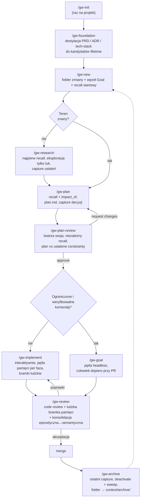
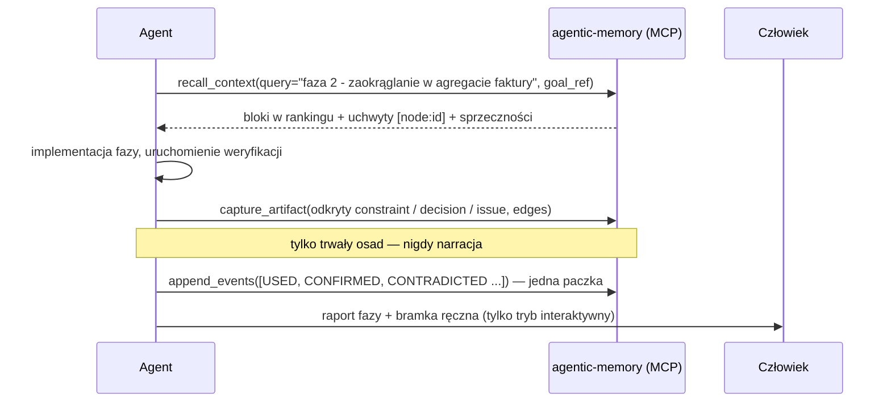
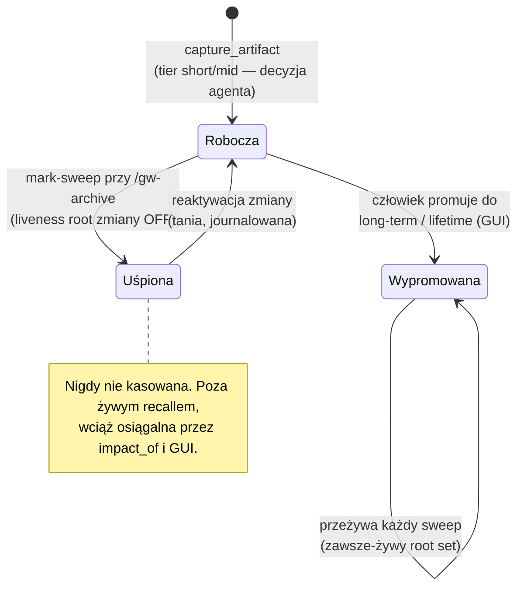
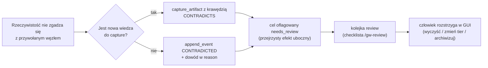

# graph-workflow — Przewodnik użytkownika

*(English version: [USAGE.en.md](USAGE.en.md))*

Ten przewodnik pokazuje, jak używać workflow na co dzień: konfiguracja, pełny
przykład zmiany od początku do końca, tryb headless, bramki review i archiwizacji
— plus przypadki brzegowe, na które trafisz, i założenia, na których opiera się
cały projekt.

Najpierw przeczytaj [README](../README.md) (jednostronicowy przegląd); ten
dokument to podręcznik praktyka.

---

## 1. Szeroki obraz

Jeden cykl życia. Pliki niosą *stan cyklu życia* (to, czego człowiek lub świeży
agent potrzebuje, żeby odnaleźć pracę); graf pamięci niesie *wiedzę* (to, czego
każda przyszła zmiana potrzebuje, żeby nie powtórzyć ani nie zaprzeczyć tej
obecnej).



---

## 2. Konfiguracja

### 2.1 Wymagania wstępne

- Sklonowany [agentic-memory-system](https://github.com/mt3o-dev/agentic-memory-system),
  dostępne `uv`.
- Serwer MCP zarejestrowany w kliencie agenta:

  ```sh
  claude mcp add agentic-memory -- uv run --directory /path/to/agentic-memory-system agentic-memory-mcp
  ```

- Skille `gw-*` skopiowane do `~/.claude/skills/` (globalnie) lub
  `<projekt>/.claude/skills/`.

### 2.2 Inicjalizacja projektu

```
/gw-init
```

Tworzy cienką strukturę folderów, weryfikuje że powierzchnia MCP odpowiada
i dokleja snippet workflow do `CLAUDE.md` projektu:

```
context/
  changes/     # aktywne zmiany: <change-id>/{change.md, plan.md, research.md}
  archive/     # niemutowalne — nic tu nigdy nie pisze
  foundation/  # PRD, roadmapa, tech-stack (ludzkie źródło prawdy)
context/memory-graph.db   # store — w .gitignore, synchronizacja przez dump/restore
```

### 2.3 Załadowanie fundamentów (brownfield albo zaraz po napisaniu PRD)

```
/gw-foundation
```

Skill otwiera dedykowany zakres pamięci `foundation` i destyluje **treść
normatywną** dokumentów do węzłów — nie streszczenia, lecz stwierdzenia:

| Skąd | Typ węzła | Przykładowa treść |
|---|---|---|
| Niepodważalne z PRD | `constraint` | „Faktury po wystawieniu są niemutowalne; korekty przez noty korygujące." |
| Pojęcie domenowe | `concept` | „Agregat faktury jest właścicielem pozycji; sumy są wyliczane, nigdy przechowywane." |
| Wybór tech-stack / ADR | `decision` | „Postgres zamiast SQLite: PRD §3 wymaga równoległych zapisów." |
| Znana, zaakceptowana luka | `issue` | „Brak wielowalutowości w v1; kwoty zakładają PLN." |

Wszystko, co zostało zcapture'owane, dostajesz jako **listę kandydatów do
promocji lifetime**. Promuj w GUI (`uv run agentic-memory-gui` → kontrolki
tierów) — to działanie wyłącznie ludzkie i to właśnie ono umieszcza wiedzę
fundamentową w zawsze-żywym root secie, z którego czerpie każdy przyszły recall.

> **Po co to?** Graf startuje pusty. Bez tego kroku pierwsze dziesięć zmian
> działa na recallach, które nic nie wiedzą, a agenci wyprowadzają (albo
> naruszają) PRD od zera.

---

## 3. Pełny przykład od początku do końca

Scenariusz: VAT na fakturach zaokrąglany jest per faktura; wytyczne podatkowe
wymagają zaokrąglania per pozycja. Projekt zainicjalizowany, fundamenty
załadowane.

### 3.1 Otwarcie zmiany — `/gw-new`

Agent ustala tożsamość i tworzy obie połowy naraz:

`context/changes/invoice-vat-rounding/change.md`:

```markdown
# invoice-vat-rounding

status: open
created: 2026-07-16

## Goal
Zaokrąglać VAT per pozycja (half-up) zamiast per faktura, zgodnie z wytycznymi 2025.

memory_goal: node_7f3a
```

Za kulisami:

```
create_change(change_id="invoice-vat-rounding",
              goal="Zaokrąglać VAT per pozycja (half-up) zamiast per faktura, zgodnie z wytycznymi 2025.")
→ {change_node_id: "node_7f39", goal_node_id: "node_7f3a", activated: true}

recall_context(query="zaokrąglanie VAT faktury", goal_ref="node_7f3a")
```

Recall startowy zwraca bloki w rankingu — dzięki `/gw-foundation` nie jest pusty:

```
[node:node_0012] (constraint, lifetime) Faktury po wystawieniu są niemutowalne; korekty przez noty korygujące.
[node:node_0013] (concept, lifetime) Agregat faktury jest właścicielem pozycji; sumy są wyliczane, nigdy przechowywane.
[node:node_0451] (decision, long-term, disputed) VAT liczony od sumy faktury, potem zaokrąglany half-up.
contradictions: node_0451 ↔ node_0562
```

Zwróć uwagę na tag `disputed` — to dokładnie ta wiedza, którą ta zmiana ma
obalić.

### 3.2 Plan — `/gw-plan`

Plan ma zastąpić `node_0451`, więc najpierw promień rażenia:

```
impact_of(node_ref="node_0451")
→ depth=1 [node:node_0788] (invariant) Suma faktury równa się sumie sum pozycji.
  depth=2 [node:node_0790] (decision) Raporty czytają sumy z nagłówka faktury.
```

Dwa zależne węzły — zmiana nie jest lokalna, ale jest ograniczona. Plan dostaje
wpis ryzyka dla ścieżki raportów. Potem `plan.md` (fazy + komendy weryfikacji,
cienko) i capture na granicy planu:

```
capture_artifact(content="VAT zaokrąglany half-up per pozycja; suma faktury to suma zaokrąglonych VAT-ów pozycji. Zastępuje zaokrąglanie na poziomie faktury.",
                 type="decision",
                 goal_ref="node_7f3a",
                 facets=["invoicing"],
                 edges=[{"target": "node_0451", "type": "CONTRADICTS", "direction": "out"},
                        {"target": "node_0013", "type": "DEPENDS_ON", "direction": "out"}],
                 tier="mid-term")
→ {node_id: "node_0801", side_effects: ["node_0451 flagged needs_review"]}
```

Krawędź CONTRADICTS *rejestruje* konflikt i flaguje starą decyzję do ludzkiego
review. Agent nigdy nie „kasuje" starej wiedzy — na tym polega model
bezpieczeństwa.

Przed implementacją plan przechodzi bramkę `/gw-plan-review`: **świeża sesja**
niezależnie recall'uje ustalone constrainty celu (nie ufając cytowaniom samego
planu jako pełnemu obrazowi) i sprawdza plan względem nich — po cichu naruszony
constraint albo supersesja bez `impact_of` odsyła plan do `/gw-plan`. Tutaj
przechodzi: capture CONTRADICTS dla `node_0451` istnieje, a ryzyko ścieżki
raportów niesie wynik `impact_of`.

### 3.3 Implementacja — `/gw-implement`

Każda faza przebiega w tej samej pętli:



Przykładowa paczka feedbacku na koniec fazy:

```
append_events([
  {"event_type": "USED",        "node_ref": "node_0801", "reason": "faza 2 implementuje to zaokrąglanie"},
  {"event_type": "CONFIRMED",   "node_ref": "node_0788", "reason": "test własności: suma faktury == suma sum pozycji"},
  {"event_type": "CONTRADICTED","node_ref": "node_0790", "reason": "raporty czytają ze zmaterializowanego widoku od migracji 0042"}
])
```

`CONFIRMED` znaczy *aktywnie zweryfikowane* (uruchomione, przetestowane) —
mocniejsze niż `USED`; nie zawyżaj. Zdarzenie `CONTRADICTED` flaguje `node_0790`
do kolejki review.

### 3.4 Review — `/gw-review`

`/gw-review` działa jako świeża sesja, więc najpierw recall'uje ustalone węzły
`constraint`/`invariant` celu dla dotkniętych podsystemów i recenzuje diff
względem nich — naruszony ustalony constraint to finding typu request-changes.
Gdy kod zaprzecza constraintowi, kierunek jest decyzją w momencie review: albo kod
jest błędny (popraw go), albo constraint jest już nieaktualny (zapisz
`CONTRADICTED`, pozwól mu oflagować). Następnie dwie części — code review względem
`plan.md` i standardów repo, oraz **ludzka bramka pamięci**, wpisana do opisu PR:

```markdown
## Memory review (bramka ludzka)
Sporne węzły dotknięte przez tę zmianę:
- [node:node_0451] VAT liczony od sumy faktury — zaprzeczony przez node_0801 (kluczowa decyzja tej zmiany)
- [node:node_0790] raporty czytają sumy z nagłówka faktury — zaprzeczone dowodem: migracja 0042

Kandydaci do promocji (CONFIRMED, wyglądają na trwałe):
- [node:node_0801] decyzja o zaokrąglaniu VAT per pozycja — podsumowanie zmiany od niej zależy; sugestia long-term
- [node:node_0812] podsumowanie zmiany: „invoice-vat-rounding przełączyła VAT na zaokrąglanie per pozycja half-up…" — sugestia long-term

Otwórz kolejkę review: `uv run agentic-memory-gui` → zakładka Review.
```

`node_0812` to **artefakt konsolidacji** — jeden węzeł `concept` destylujący, co
zmiana zrobiła i dlaczego, z krawędziami `DEPENDS_ON` do jej kluczowych decyzji.
Po promocji przyszłe recalle w tym rejonie dostają esencję epizodu nawet wtedy,
gdy szczegóły są już uśpione.

### 3.5 Archiwizacja — `/gw-archive`

Po merge'u:

```sh
uv run python scripts/memory_lifecycle.py deactivate invoice-vat-rounding --sweep
git mv context/changes/invoice-vat-rounding context/archive/invoice-vat-rounding
# jeden commit: przeniesienie folderu + liczba węzłów ze sweepa w opisie
```

Sweep wypisuje dokładnie, które węzły zasnęły. Węzły wypromowane (`node_0801`,
`node_0812`, potwierdzony inwariant) pozostają żywe.

---

## 4. Tryb headless — `/gw-goal`

Dla zmian ograniczonych, których poprawność sprawdza komenda. Ta sama pozycja w
cyklu życia co `/gw-implement`, inna ścieżka walidacji:

```
recall → próba → weryfikacja → (porażka: diagnoza, retry ≤ 3) → capture + journal → następna faza
```

Twarde warunki wstępne — skill odmawia startu bez nich:

1. `plan.md` istnieje i ma komendę weryfikacji per faza.
2. `memory_goal` obecny w `change.md`.
3. Warunek stopu sprawdzalny komendą, nie gustem.

Zachowania specyficzne dla headless:

- Węzeł `disputed`, który istotnie wpływa na fazę, to **warunek stopu** — agent
  bez nadzoru nie obstawia żadnej strony sprzeczności.
- Wyczerpane retry → capture artefaktu `issue` z dowodami porażki,
  `status: blocked`, stop. Uczciwy wynik częściowy bije miotającą się pętlę.
- Wyjście zawsze emituje raport przebiegu: ukończone fazy, wyniki weryfikacji,
  lista `[node:id]` capture'ów, zarejestrowane sprzeczności. Ten raport czyta
  człowiek przed `/gw-review`.

---

## 5. Jak wiedza żyje i umiera



Oraz ścieżka sprzeczności — jedyny sposób obsługi „błędnej" wiedzy:



Agent rejestruje, że konflikt istnieje; nigdy nie decyduje, kto wygrywa. Trust
jest wyliczany (folding) z journala przez uprzywilejowaną konserwację — żadne
wywołanie agenta nie może go ustawić.

---

## 6. Przypadki brzegowe

**Serwer pamięci nie działa / niezarejestrowany.** Workflow degraduje się do
czystego 10x — same pliki. Capture'y są *tracone, nie kolejkowane*: nie
uruchamiaj faz wiedzochłonnych (research, granice planu), dopóki nie wróci.
`gw-init` mówi, że powierzchnia jest martwa; uwierz mu.

**`change.md` bez `memory_goal`.** Ktoś otworzył zmianę ręcznie. Wykonaj kroki
zakresu z `/gw-new` (`create_change` + zapis id), zanim cokolwiek
scapture'ujesz — `capture_artifact` z założenia odrzuca zapisy bez celu.

**`create_change` mówi, że zmiana już istnieje.** Nie mintuj drugiej. Odzyskaj
goal id z `change.md`; jeśli plik go zgubił, węzeł zmiany żyje pod
`/change/<change-id>` — znajdź go w GUI.

**Recall startowy wraca (prawie) pusty.** Na młodym storze to poprawne, nie
porażka. Jeśli na dojrzałym storze wciąż pusto — sformułowanie zapytania minęło
się ze słownictwem grafu; ponów z terminami domenowymi (nazwy facetów, etykiety
konceptów).

**Przywołany węzeł jest `disputed`.** Interaktywnie: rozważ obie strony w
planie/analizie, jawnie, i powiedz, na której budujesz. Headless: warunek stopu
— zostaw dla bramki PR.

**`facet_warnings` przy capture.** Strażnik słownika znalazł bliski synonim
(„czy chodziło o `invoicing`?"). Zdecyduj świadomie: ponów wywołanie z
sugerowanym facetem albo zostaw swój, bo naprawdę jest odrębny. Nigdy nie
ignoruj po cichu — dryf facetów rozszczepia graf.

**Sweep uśpił coś, co miało przeżyć.** Nigdy nie zostało wypromowane powyżej
short-term. Reaktywuj (`memory_lifecycle.py activate <change-id>`), niech
człowiek wypromuje w GUI, deaktywuj ponownie. Nie edytuj store'a ręcznie.

**Jakakolwiek ścieżka zapisu prowadzi pod `context/archive/`.** Przerwij,
zawsze, z komunikatem: *„Ta zmiana jest zarchiwizowana. Otwórz nową przez
/gw-new."* Kontynuacja pracy dostaje nową zmianę z `parent_refs` wskazującymi
na ocalałe węzły starej.

**Dwie równoległe zmiany sobie zaprzeczają.** Dzielą jeden store, więc recall
drugiego agenta *zobaczy* świeżą decyzję pierwszego — zwykle jako parę
`disputed`, gdy tylko wyląduje krawędź CONTRADICTS. To system działa poprawnie:
konflikt trafia do kolejki review zamiast po cichu do merge'a. Równoległość
pozostaje ograniczona przepustowością review dokładnie z tego powodu.

**Headless wyczerpał retry.** Spodziewaj się `status: blocked`, węzła `issue` z
dowodami i raportu przebiegu. Triage: napraw plan (zwykle) albo komendę
weryfikacji (czasem), potem uruchom ponownie pod tym samym change-id.

**Zmiana porzucona.** I tak zamknij ją porządnie: capture wniosków (często
najcenniejsze węzły `issue`/`constraint` pochodzą z porażek), journal, potem
`/gw-archive` ze `status: abandoned` w `change.md`. Sweep uśpi szum; wnioski
przeżyją, jeśli wypromowane.

**Zmieniony dokument fundamentowy.** To zmiana jak każda inna, plus przepływ
poprawki: recall subgrafu fundamentów, `impact_of` węzłów unieważnianych przez
edycję (węzły fundamentowe mają najszerszy promień rażenia w storze — głęboki
wynik to decyzja na poziomie projektu), capture nowych stwierdzeń z krawędziami
CONTRADICTS i ludzka re-promocja. Nigdy nie synchronizuj dok→graf po cichu.

**Współdzielenie store'a w zespole.** Plik SQLite jest w .gitignore; formatem
synchronizacji jest czytelny dump (`scripts/dump_db.py` / `restore_db.py`).
Dump przed pushem, restore po pullu. Równoległy zapis binarki przez dwie osoby
jest niezdefiniowany — powierzchnią merge'a jest dump.

---

## 7. Założenia i ograniczenia

1. **Jeden store na projekt**, w `context/memory-graph.db`, którego właścicielem
   jest serwer MCP. Wspólny store wycelowany w dwa projekty zatruwa oba.
2. **Człowiek istnieje.** Rozstrzyganie flag, promocja tierów i bramka review są
   z założenia wyłącznie ludzkie. W pełni bezobsługowe pipeline'y mogą
   uruchamiać `/gw-goal`, ale nic nie jest promowane, a spory narastają, aż
   człowiek przerobi kolejkę.
3. **Przepustowość review jest limitem throughputu.** Więcej równoległych
   agentów bez review to więcej niezrecenzowanego kodu *i* nieprzerobiona
   kolejka review.
4. **Powierzchnia agenta nie może szkodzić** — brak mutacji trustu, czyszczenia
   flag, promocji, archiwizacji. Jeśli krok workflow zdaje się którejś z nich
   potrzebować — zły jest krok, nie powierzchnia.
5. **Jakość capture to sufit.** Retrieval jest deterministyczny (ten sam graf +
   to samo zapytanie → ten sam ranking; bez LLM w ścieżce zapytania), więc to,
   co serwuje recall, jest dokładnie tak dobre, jak to, co zapisał capture.
   Jedno czytelne „na zimno" stwierdzenie na węzeł, krawędzie nazwane w momencie
   capture.
6. **Feedback jest obowiązkowy**, jedna paczka na fazę/sesję. Sesje
   niezaraportowane są dla rankingu niewidzialne — graf powoli przestaje
   serwować to, czego faktycznie używasz.
7. **`uv` i repo pamięci** są osiągalne z projektu dla skryptów cyklu życia
   (`memory_lifecycle.py`) i GUI.
8. **Słownik facetów jest kontrolowany.** Nowy facet to akt świadomy, pilnowany
   przez detektor kolizji — nie wolna chmura tagów.
9. **plan.md to sekwencjonowanie, nie wiedza.** Może umrzeć razem ze zmianą;
   decyzje, które ucieleśniał, zostały scapture'owane na granicy planu i żyją
   dalej.
