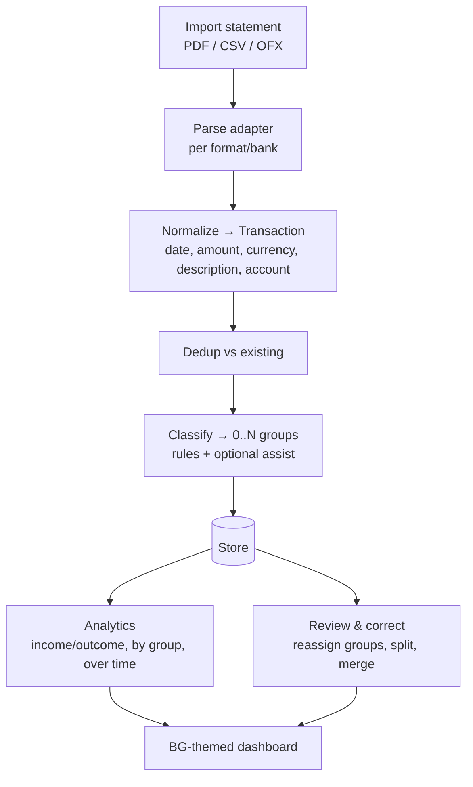

# PRD — Coffer

**Coffer** is a self-hosted personal-finance analytics application for bank
transaction history. You import statements (PDF and structured formats), Coffer
classifies each transaction into one or more groups, and it visualizes income
and outflow over time. The interface is themed after classic CRPGs (Baldur's
Gate / Forgotten Realms): your accounts are *coffers*, categories are *ledgers*,
importing is *tallying the takings*. The theme is skin-deep flavor over rigorous
analytics — never at the expense of legibility of the numbers.

> **Self-hosted & private by construction.** All data stays on the user's own
> deployment. No transaction data leaves the host. Any online capability (e.g.
> an optional LLM-assisted categorization adapter) is opt-in, off by default,
> and clearly labeled.

## Personas

- **The steward** — a private individual tracking household finances across
  several accounts, wants categorization and trends without a cloud service.
- **The archivist** — imports years of historical statements and wants
  reliable parsing, dedup, and correction tools.

## Core flow

## Functional requirements

1. **Import** — statements via **PDF** (primary requirement), plus CSV and OFX.
   PDF parsing runs behind an adapter per layout; the app ships a generic
   tabular-PDF parser and a pluggable per-bank profile system (a profile maps a
   detected layout to columns). Import is idempotent (re-importing the same
   statement does not duplicate transactions — content-hash dedup).
2. **Normalization** — every parsed row becomes a `Transaction`: booking date,
   value date, amount (minor units + ISO currency), direction (in/out),
   counterparty, raw description, source account, import batch id.
3. **Multi-group classification** — a transaction belongs to **zero or more
   groups** (many-to-many), not a single category. Groups are user-defined and
   nestable (e.g. `Living > Rent`, `Living > Utilities`), plus cross-cutting
   tags (`recurring`, `business`, `refundable`). Classification is by
   **ordered rules** (match on description regex, counterparty, amount range,
   account) that can assign several groups; unmatched transactions land in a
   review queue. An **optional** assist adapter (local heuristic default; online
   LLM opt-in) can suggest groups — suggestions are never auto-committed.
4. **Analytics & diagrams** — income vs outcome over time (line/area), spend by
   group (bar/treemap), group trends, cashflow balance; because a transaction
   can match multiple groups, analytics distinguishes **overlapping** (sum may
   exceed total; each group counts it) from **partitioned** views (a transaction
   is apportioned/attributed once) and labels which is shown. Date-range and
   account filters throughout.
5. **Review & correction** — reassign groups, split a transaction across groups
   with amounts, merge duplicates the dedup missed, and turn a manual correction
   into a reusable rule ("always classify like this").
6. **Multilingual (i18n)** — full UI translation with a message-catalog system;
   ship English + Polish at minimum, structured so more locales are drop-in.
   Locale affects number, currency, and date formatting. Content (group names)
   is user data, not translated; chrome is translated.
7. **Self-hosted deployment** — one `docker compose up` brings up the app with a
   persistent volume; no external services required for the default feature set.

## Non-functional requirements

- **Hexagonal architecture**, dependency injection, clean code — domain core
  (import, classification, analytics) free of framework/DB/PDF-library imports.
- **Config layers** for deployment (defaults < env file < env vars), including
  DB path, default locale, and adapter selection.
- **Feature-rich but shippable in slices** — see `roadmap.md`; the epic is
  delivered as vertical slices, each independently verifiable.
- **Tests**: vitest for unit/component; an e2e path chosen at plan time.
- **Diagrams**: architecture and flows documented with mermaid.

## Accepted gaps (v1)

- No bank API / open-banking live sync — import only.
- No multi-user accounts (a deployment is one household). **Amended 2026-07-24
  (supersedes "reverse-proxy auth is the user's concern"):** the app ships a
  minimal single-passphrase gate — passphrase from the config layer
  (`COFFER_AUTH__PASSWORD`), verified server-side, signed session cookie, all
  routes gated, login screen part of the design system and i18n'd. Required
  because the dogfood deployment is public (coffer.rashell.pl); hosting-level
  PoW/WAF complements but does not replace it.
- Currency conversion is display-only using user-supplied rates; no live FX.
- OCR of scanned (image-only) PDFs is out of scope — text-layer PDFs only in v1.
