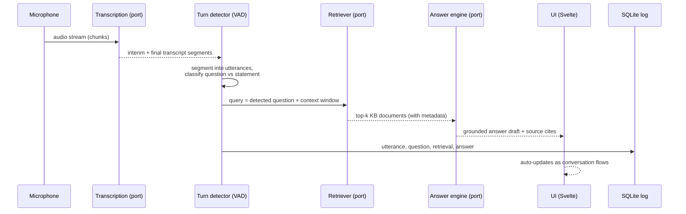
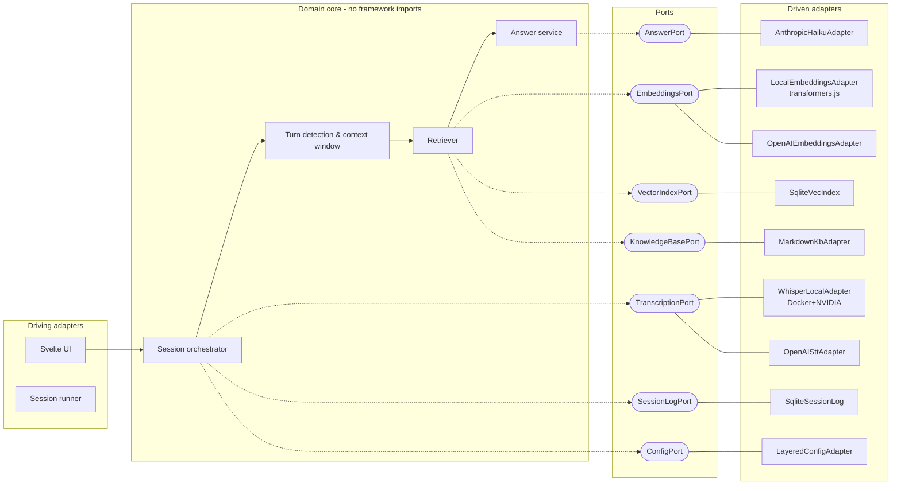

# PRD — Interview Copilot

An interview-preparation aid that listens to a live job interview, transcribes it
in real time, detects the interviewer's questions, retrieves the best-matching
prepared answers from a personal knowledge base (RAG), and drafts a grounded
answer suggestion for the interviewee — automatically, without manual triggering.

> **Ethics note (accepted scope):** the product is positioned as a *preparation
> and mock-interview* tool. Using it covertly in a real interview may violate the
> interviewing company's policies; this is the user's responsibility. The app
> makes no attempt to hide itself.

## Personas

- **The candidate** — preparing for CS/software interviews, has a pool of
  prepared answers, wants realtime recall aid during mock interviews.
- **The coach** — runs mock interviews, reviews session logs afterwards.

## Core flow

## Functional requirements

1. **Realtime transcription** from the microphone with two interchangeable
   adapters: local (whisper-derivative served from Docker, NVIDIA GPU) and
   online (OpenAI transcription API). Switchable via configuration.
2. **Automatic turn handling** — no push-to-talk. Voice-activity detection
   segments speech into utterances; a question detector decides when to fire
   retrieval. Reacts to both interviewer and interviewee talking (interviewee
   speech extends context but does not trigger retrieval).
3. **RAG over a markdown knowledge base** — questions/answers as markdown files
   with frontmatter metadata: `category` (frontend, backend, theory,
   behavioral), `difficulty` (junior/mid/senior), `expertise`, `tags`.
   Embedding-based similarity search with two embedding adapters (local model,
   online API); index persisted in SQLite (sqlite-vec).
4. **Grounded answer drafting** via an LLM behind an adapter — Haiku today,
   swappable without touching the core.
5. **Session logging** — every utterance, retrieval, and answer to a local
   SQLite database; browsable per session.
6. **Knowledge base of ≥100 questions** covering frontend, backend, CS theory
   (ACID/BASE, DDD, complexity, networking), and behavioral questions.
7. **Configuration layers** — packaged defaults < environment config < user
   config file < environment variables. Adapter selection lives in config.

## Non-functional requirements

- **Hexagonal architecture** — domain core with ports; adapters at the edges;
  dependency injection via an explicit composition root. Core has zero imports
  from Tauri, network SDKs, or the filesystem.
- **Clean code** — small units, intention-revealing names, tests first-class.
- **Stack**: Tauri 2 + Svelte 5 + TypeScript. Local processing assumes Docker
  with NVIDIA hardware; online adapters must work without any local GPU.
- **Tests**: vitest (+ Testing Library) for unit/component; WebdriverIO +
  tauri-driver for e2e.
- **Privacy**: audio never leaves the machine when local adapters are selected.

## Architecture (target)

## Known accepted gaps (v1)

- Single-microphone capture; interviewer/interviewee separation is heuristic
  (VAD turns + question classification), not diarization.
- Whisper local adapter expects an external whisper server (Docker); the app
  does not manage the container lifecycle.
- No answer streaming to the UI in v1 (single completion per question).
- English-language KB and question detection only.
