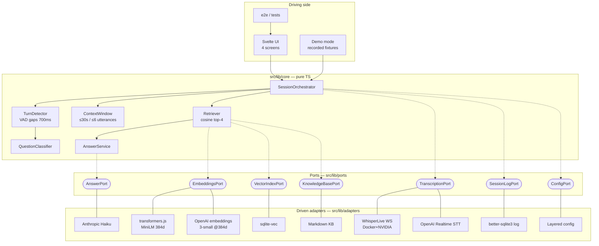
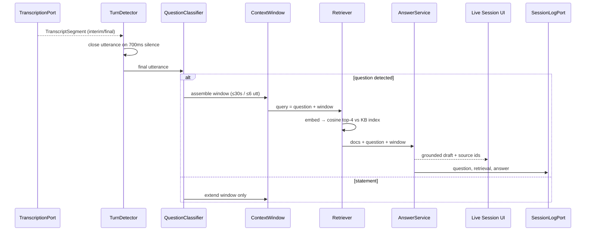

# Architecture — Interview Copilot

Hexagonal (ports & adapters), dependency direction always inward. The core has
zero imports from SvelteKit, Tauri, network SDKs, or node builtins — enforced by
a boundary-lint test in the suite.

## The hexagon



## Runtime flow (one question)



## Adapter matrix

| Port | Local (Docker/NVIDIA budget) | Online | Selected by |
|---|---|---|---|
| TranscriptionPort | WhisperLive-protocol WS client | OpenAI Realtime (`gpt-4o-mini-transcribe`) | `stt.adapter` |
| EmbeddingsPort | transformers.js `all-MiniLM-L6-v2` (384d) | OpenAI `text-embedding-3-small` @ `dimensions: 384` | `embeddings.adapter` |
| AnswerPort | — (future: local LLM) | Anthropic `claude-haiku-4-5` | `answer.adapter` |

Shared index geometry (384 dims) keeps one sqlite-vec index valid for either
embeddings adapter; the index records `(model, dimensions)` and refuses
mismatched queries — switching models means reindexing, by design.

## Configuration layers (lowest → highest precedence)

```
config/default.json  <  config/<env>.json  <  ~/.config/interview-copilot/config.json  <  IC_* env vars (`__` nesting)
```

Adapter selection, VAD gap, context-window limits, top-k are all config, never
code. The Settings screen displays which layer won for each value.

## Testing strategy

| Layer | Tool | What |
|---|---|---|
| Core | vitest + in-memory fakes | unit + recorded-transcript fixture walk-through |
| Ports | shared contract suites | every fake AND every offline-runnable adapter |
| Adapters (network) | mocked transport | protocol framing, error paths |
| UI | vitest + Testing Library (jsdom) | components + live-session store over fixtures |
| E2e | WebdriverIO + tauri-driver | smoke + demo-mode answer flow (runs on a Rust machine; see deferred-verification.md) |

## Rust shell (src-tauri)

Deliberately thin: window bootstrap, `get_app_data_dir`, and a
`spawn_sidecar_hint` stub marking the seam where Whisper-container lifecycle
management would attach (a v1 non-goal). All domain logic stays in TypeScript.
